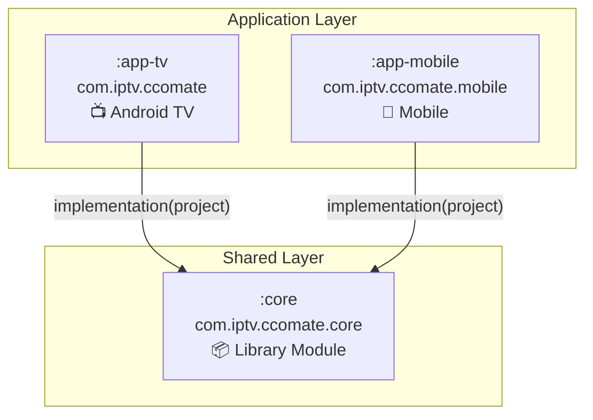
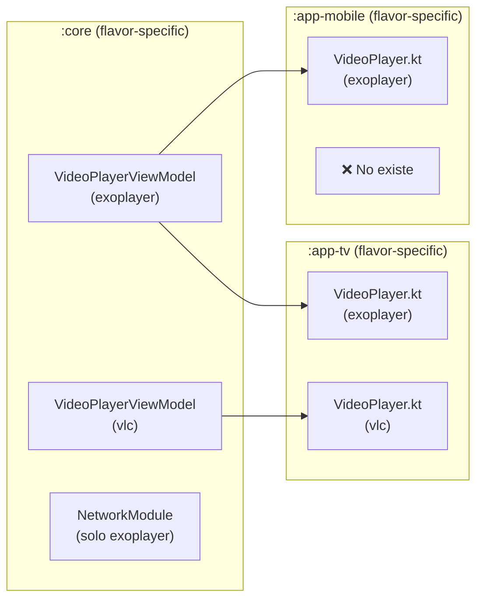
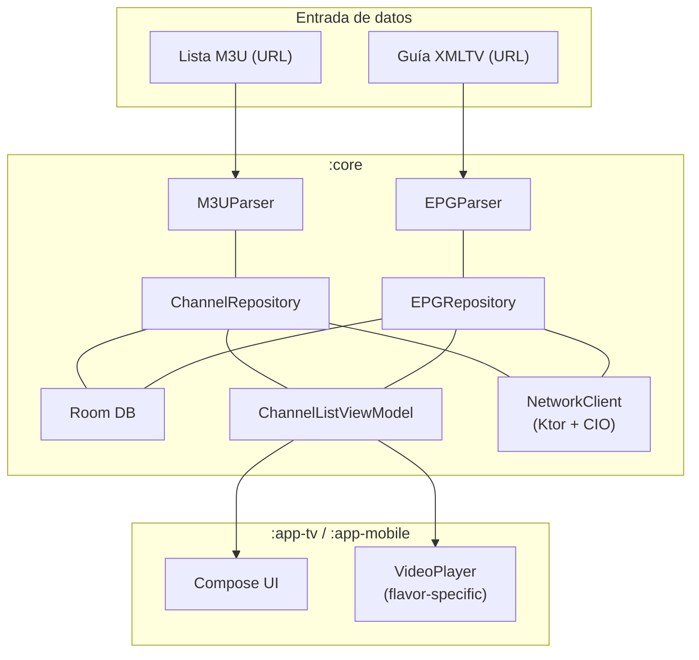

# SNAPSHOT TÉCNICO: ETAPA 1 — Infraestructura y Grafo de Dependencias

> **Proyecto:** CCOMate  
> **Tipo:** Android Multi-módulo (IPTV Player)  
> **Root package:** `com.iptv.ccomate`  
> **Fecha de análisis:** 2026-04-04  
> **Status:** ✅ **100% Implementado** (actualizado 2026-04-04 - P1 falso positivo corregido)

---

## 1. Arquitectura de Módulos

El proyecto sigue un patrón **Clean Architecture simplificado** con 3 módulos Gradle:



| Módulo | Tipo Gradle | Application ID | Namespace | minSdk | targetSdk |
|--------|-------------|---------------|-----------|--------|-----------|
| `:app-tv` | `com.android.application` | `com.iptv.ccomate` | `com.iptv.ccomate` | **24** | 35 |
| `:app-mobile` | `com.android.application` | `com.iptv.ccomate.mobile` | `com.iptv.ccomate.mobile` | **26** | 35 |
| `:core` | `com.android.library` | — | `com.iptv.ccomate.core` | **24** | — |

> [!IMPORTANT]
> `:core` expone sus dependencias principales como **`api`** (no `implementation`), lo que permite que ambos módulos de aplicación accedan transitivamente a Room, Hilt, Ktor, Lifecycle, Coil, OkHttp, y Commons-Net sin declararlas de nuevo.

---

## 2. Stack Tecnológico Completo

### 2.1 Versiones Clave (de `libs.versions.toml`)

| Tecnología | Versión | Propósito |
|-----------|---------|-----------|
| **AGP** | 9.0.1 | Android Gradle Plugin |
| **Kotlin** | 2.0.21 | Lenguaje principal |
| **Compose BOM** | 2025.04.00 | Jetpack Compose UI |
| **KSP** | 2.0.21-1.0.28 | Procesamiento de anotaciones (reemplaza KAPT) |
| **Hilt** | 2.55 | Inyección de dependencias |
| **Room** | 2.7.2 | Persistencia local (SQLite) |
| **Ktor Client** | 2.3.6 | HTTP Client (CIO engine) |
| **OkHttp** | 4.12.0 | HTTP Client (para Media3 DataSource) |
| **Media3 / ExoPlayer** | 1.6.1 | Player multimedia (flavor `exoplayer`) |
| **LibVLC** | 3.5.1 | Player multimedia (flavor `vlc`) |
| **Coil** | 2.5.0 / 2.6.0 | Carga de imágenes (incluye SVG) |
| **Navigation Compose** | 2.8.9 | Navegación declarativa |
| **Lifecycle** | 2.8.7 | ViewModel + StateFlow |
| **Material3** | 1.3.2 | Diseño Material 3 (mobile) |
| **TV Foundation** | 1.0.0-alpha12 | Compose for TV |
| **TV Material** | 1.1.0-alpha01 | Material Design para TV |
| **Commons-Net** | 3.9.0 | NTP / utilidades de red |
| **Desugar JDK Libs** | 2.1.5 | APIs de Java 8+ en minSdk 24 |
| **Compose Animation** | 1.7.8 | Animaciones |
| **Compose Foundation** | 1.7.8 | Layouts fundamentales |
| **SLF4J Android** | 1.7.36 | Logging (para Ktor) |
| **compileSdk** | **35** | Android 15 |

### 2.2 Plugins Gradle Aplicados

| Plugin | `:core` | `:app-tv` | `:app-mobile` |
|--------|---------|-----------|---------------|
| `com.android.library` | ✅ | — | — |
| `com.android.application` | — | ✅ | ✅ |
| `kotlin-android` | ✅ | ✅ | ✅ |
| `kotlin-compose` | ✅ | ✅ | ✅ |
| `kotlin-parcelize` | ✅ | ✅ | — |
| `ksp` | ✅ | ✅ | ✅ |
| `hilt-android` | ✅ | ✅ | ✅ |

> [!NOTE]
> `kotlin-parcelize` se usa en `:core` y `:app-tv` pero **no** en `:app-mobile`, lo que sugiere que los modelos `Parcelable` viajan entre Activities/Fragments principalmente en TV.

---

## 3. Product Flavors: Estrategia de Player Dual

Los **tres** módulos definen la misma dimensión de flavor `player` con dos variantes:

```
flavorDimensions += "player"
productFlavors {
    create("exoplayer") { dimension = "player" }
    create("vlc")       { dimension = "player" }
}
```

### 3.1 Archivos Específicos por Flavor

La estrategia se implementa mediante **source sets separados** que proveen implementaciones alternativas de la misma interfaz/clase:

```
Flavor: exoplayer                          Flavor: vlc
─────────────────────────────              ──────────────────────────
core/src/exoplayer/                        core/src/vlc/
  └── java/.../di/NetworkModule.kt            (no NetworkModule)
  └── java/.../viewmodel/                  └── java/.../viewmodel/
        VideoPlayerViewModel.kt                  VideoPlayerViewModel.kt

app-tv/src/exoplayer/                      app-tv/src/vlc/
  └── java/.../ui/video/                   └── java/.../ui/video/
        VideoPlayer.kt                           VideoPlayer.kt

app-mobile/src/exoplayer/                  app-mobile/src/vlc/
  └── java/.../ui/video/                   └── java/.../ui/video/
        VideoPlayer.kt                           VideoPlayer.kt ✅
```

> [!NOTE]
> **`app-mobile/src/vlc/`** está **completamente implementado** — el flavor VLC para mobile tiene implementación de `VideoPlayer.kt`. Compila y funciona exitosamente (verificado por usuario).

### 3.2 Patrón de Abstracción



> El `NetworkModule.kt` en el flavor `exoplayer` probablemente configura OkHttp con manejo especial de certificados para que `media3-datasource-okhttp` funcione con IPTV (canales HTTPS con certificados auto-firmados).

---

## 4. Grafo de Dependencias Detallado

### 4.1 `:core` → Librerías (todo expuesto con `api`)

```mermaid
graph TD
    CORE[":core"]

    subgraph "DI"
        HILT["hilt-android 2.55"]
    end

    subgraph "Persistencia"
        ROOM_RT["room-runtime 2.7.2"]
        ROOM_KTX["room-ktx"]
    end

    subgraph "Red"
        KTOR_CORE["ktor-client-core 2.3.6"]
        KTOR_CIO["ktor-client-cio"]
        OKHTTP["okhttp 4.12.0"]
    end

    subgraph "Player (conditional)"
        LIBVLC["libvlc-all 3.5.1<br/>(vlcApi)"]
        MEDIA3_EXO["media3-exoplayer 1.6.1<br/>(exoplayerApi)"]
        MEDIA3_HLS["media3-exoplayer-hls<br/>(exoplayerApi)"]
        MEDIA3_UI["media3-ui<br/>(exoplayerApi)"]
        MEDIA3_DS["media3-datasource-okhttp<br/>(exoplayerApi)"]
    end

    subgraph "UI / Imágenes"
        COIL["coil-compose 2.5.0"]
        COIL_SVG["coil-svg 2.6.0"]
    end

    subgraph "Lifecycle"
        LF_COMPOSE["lifecycle-runtime-compose 2.8.7"]
        LF_KTX["lifecycle-runtime-ktx"]
    end

    subgraph "Utilidades"
        COMMONS["commons-net 3.9.0<br/>(NTP)"]
        DESUGAR["desugar_jdk_libs 2.1.5"]
    end

    CORE -->|api| HILT
    CORE -->|api| ROOM_RT
    CORE -->|api| ROOM_KTX
    CORE -->|api| KTOR_CORE
    CORE -->|api| KTOR_CIO
    CORE -->|api| OKHTTP
    CORE -->|api| COIL
    CORE -->|api| COIL_SVG
    CORE -->|api| LF_COMPOSE
    CORE -->|api| LF_KTX
    CORE -->|api| COMMONS
    CORE -->|vlcApi| LIBVLC
    CORE -->|exoplayerApi| MEDIA3_EXO
    CORE -->|exoplayerApi| MEDIA3_HLS
    CORE -->|exoplayerApi| MEDIA3_UI
    CORE -->|exoplayerApi| MEDIA3_DS
```



### 4.2 `:app-tv` → Dependencias propias

| Dependencia | Scope | Propósito |
|-------------|-------|-----------|
| `project(":core")` | `implementation` | Toda la lógica compartida |
| `hilt-android` | `implementation` | DI en app module |
| `hilt-compiler` | `ksp` | Generación de código Hilt |
| `hilt-navigation-compose` | `implementation` | `hiltViewModel()` en Navigation |
| Compose BOM + UI stack | `implementation` | UI framework |
| `tv-foundation` | `implementation` | Focus, D-Pad, LazyList para TV |
| `tv-material` | `implementation` | Material Design para TV |
| `material3` | `implementation` | Material3 components |
| `navigation-compose` | `implementation` | Navegación declarativa |

### 4.3 `:app-mobile` → Dependencias propias

| Dependencia | Scope | Propósito |
|-------------|-------|-----------|
| `project(":core")` | `implementation` | Toda la lógica compartida |
| `hilt-android` + `ksp` | DI | DI en app module |
| `hilt-navigation-compose` | `implementation` | `hiltViewModel()` |
| Compose BOM + UI + Material3 | `implementation` | UI framework (sin TV Material) |
| `coil-compose` + `coil-svg` | `implementation` | Carga de imágenes |
| `navigation-compose` | `implementation` | Navegación |

> [!TIP]
> La diferencia clave entre TV y Mobile: TV usa `tv-foundation` + `tv-material` para soporte D-Pad/focus, mientras Mobile usa solo `material3` estándar.

---

## 5. Configuración de Build

### 5.1 Firma (Release)

Ambos módulos de aplicación cargan las credenciales de firma desde `keystore.properties` en la raíz del proyecto:

```kotlin
val keystoreProperties = Properties()
rootProject.file("keystore.properties").inputStream().use { keystoreProperties.load(it) }
```

### 5.2 R8 / ProGuard

| Config | `:app-tv` Release | `:app-mobile` Release | `:core` |
|--------|-------------------|----------------------|---------|
| `isMinifyEnabled` | ✅ `true` | ✅ `true` | ❌ `false` |
| `isShrinkResources` | ✅ `true` | ✅ `true` | N/A |
| ProGuard files | default + custom | default + custom | default + consumer |

### 5.3 Compilación

- **Java Compatibility:** 11 (los tres módulos)
- **JVM Target:** 11
- **Core Library Desugaring:** Habilitado en los 3 módulos (para `java.time.*` en minSdk 24)
- **KSP2:** Habilitado (`ksp.UseKSP2=true` en gradle.properties)
- **Compose:** Habilitado en los 3 módulos

---

## 6. Mapa Completo de Paquetes y Archivos

### 6.1 `:core` — `com.iptv.ccomate.*`

```
core/src/main/java/com/iptv/ccomate/
├── data/
│   ├── ChannelRepository.kt          # Repositorio de canales IPTV
│   ├── EPGParser.kt                  # Parser de guías de programación (XMLTV)
│   ├── EPGRepository.kt              # Repositorio de EPG
│   ├── M3UParser.kt                  # Parser de listas M3U
│   ├── NetworkClient.kt              # Cliente HTTP configurado
│   └── local/
│       ├── AppDatabase.kt            # Room @Database
│       ├── ChannelDao.kt             # DAO canales
│       ├── ChannelEntity.kt          # @Entity canales
│       ├── EPGDao.kt                 # DAO programación
│       └── EPGEntity.kt              # @Entity programación
├── di/
│   └── AppModule.kt                  # @Module Hilt (bindings globales)
├── model/
│   ├── Channel.kt                    # Modelo de dominio: Canal
│   ├── DrawerItem.kt                 # Modelo UI: Ítem del drawer
│   └── EPGProgram.kt                 # Modelo de dominio: Programa EPG
├── util/
│   ├── AppConfig.kt                  # Configuración de la app
│   ├── DeviceIdentifier.kt           # Identificación del dispositivo
│   ├── FullscreenUtils.kt            # Utilidades fullscreen
│   ├── SubscriptionManager.kt        # Gestión de suscripciones
│   ├── SvgUtils.kt                   # Utilidades para SVG (Coil)
│   └── TimeUtils.kt                  # Utilidades de tiempo (NTP)
└── viewmodel/
    ├── ChannelListViewModel.kt        # ViewModel principal de canales
    ├── ChannelUiState.kt              # Estado UI de canales
    ├── PlutoTvViewModel.kt            # ViewModel Pluto TV
    ├── SettingsViewModel.kt           # ViewModel configuraciones
    ├── SubscriptionViewModel.kt       # ViewModel suscripciones
    └── TdaViewModel.kt               # ViewModel TDA (TV Digital Abierta)
```

### 6.2 `:app-tv` — `com.iptv.ccomate.*`

```
app-tv/src/main/java/com/iptv/ccomate/
├── CcoMateApplication.kt             # @HiltAndroidApp
├── activity/
│   └── MainActivity.kt               # @AndroidEntryPoint Activity
├── navigation/
│   ├── CcoNavigationDrawer.kt        # Drawer personalizado para TV
│   ├── DrawerItemRenderer.kt         # Renderizado de ítems del drawer
│   ├── DrawerItemsList.kt            # Lista de ítems
│   ├── DrawerLogo.kt                 # Logo del drawer
│   ├── NavGraph.kt                   # Grafo de navegación TV
│   └── Route.kt                      # Definición de rutas
└── ui/
    ├── components/
    │   ├── SkeletonComponent.kt       # Placeholders de carga
    │   └── SubscriptionGate.kt        # Gate de suscripción
    ├── screens/
    │   ├── ChannelList.kt             # Lista de canales TV
    │   ├── DrawerIconContent.kt       # Contenido visual de íconos
    │   ├── GroupList.kt               # Lista de grupos/categorías
    │   ├── HomeScreen.kt              # Pantalla principal
    │   ├── SubscriptionStateScreens.kt# Pantallas de estado de sub.
    │   ├── UserInfoScreen.kt          # Información del usuario
    │   ├── base/
    │   │   └── ChannelScreen.kt       # Pantalla base de canales
    │   ├── pluto/
    │   │   ├── PlutoColors.kt         # Paleta Pluto TV
    │   │   ├── PlutoComponents.kt     # Componentes Pluto TV
    │   │   └── PlutoTvScreen.kt       # Pantalla Pluto TV
    │   ├── settings/
    │   │   └── SettingsScreen.kt      # Pantalla de ajustes
    │   └── tda/
    │       └── TDAScreen.kt           # Pantalla TDA
    ├── theme/                         # Tema visual TV
    └── video/
        ├── FullscreenDPadContainer.kt # Contenedor D-Pad fullscreen
        ├── VideoPanel.kt             # Panel de video
        ├── VideoPlayerBuffering.kt    # Indicador de buffering
        ├── VideoPlayerError.kt        # Manejo visual de errores
        └── VideoPlayerOverlay.kt      # Overlay de controles
```

### 6.3 `:app-mobile` — `com.iptv.ccomate.mobile.*`

```
app-mobile/src/main/java/com/iptv/ccomate/mobile/
├── CcoMateApplication.kt             # @HiltAndroidApp
├── MainActivity.kt                   # @AndroidEntryPoint + navegación
├── navigation/
│   ├── AppNavGraph.kt                 # Grafo de navegación mobile
│   └── Route.kt                      # Definición de rutas
└── ui/
    ├── screens/
    │   ├── HomeScreen.kt              # Pantalla principal mobile
    │   ├── MobileChannelScreen.kt     # Pantalla de canales adaptativa
    │   ├── PlutoTvScreen.kt           # Pluto TV mobile
    │   ├── TDAScreen.kt              # TDA mobile
    │   └── settings/
    │       └── MobileSettingsScreen.kt# Ajustes mobile
    ├── theme/                         # Tema visual mobile
    └── video/                         # (vacío en main, ver flavors)
```

---

## 7. Interdependencias y Flujo de Datos



---

## 8. Estado de Hilt

| Localización | Archivo | Tipo |
|-------------|---------|------|
| `:core` | `di/AppModule.kt` | `@Module` + `@InstallIn` — provee Room DB, DAOs, repos |
| `:core` (exoplayer) | `di/NetworkModule.kt` | `@Module` — provee config de red para ExoPlayer |
| `:app-tv` | `CcoMateApplication.kt` | `@HiltAndroidApp` |
| `:app-tv` | `activity/MainActivity.kt` | `@AndroidEntryPoint` |
| `:app-mobile` | `CcoMateApplication.kt` | `@HiltAndroidApp` |
| `:app-mobile` | `MainActivity.kt` | `@AndroidEntryPoint` |
| ViewModels (core) | 6 ViewModels | `@HiltViewModel` + `@Inject constructor` |

> [!NOTE]
> El `NetworkModule.kt` existe **sólo en el flavor `exoplayer`** del `:core`. Esto significa que la configuración de red (probablemente el trust de certificados SSL y el OkHttpClient compartido) solo aplica cuando se compila con ExoPlayer/Media3.

---

## 9. Observaciones Críticas

1. ✅ **Balance de flavors:** Ambos flavors (exoplayer y vlc) están completamente implementados en los 3 módulos, incluyendo `app-mobile`.

2. **Core como "dios":** El módulo `:core` contiene modelos, datos, viewmodels, utilidades Y configuración de UI (Compose). No hay una separación domain/data/presentation dentro de core.

3. **Dependencias `api` transitivas:** `:core` expone todo como `api`, lo que simplifica el consumo pero acopla fuertemente los módulos app a las dependencias internas de core.

4. **Doble Application:** Cada app module tiene su propio `CcoMateApplication.kt` con `@HiltAndroidApp`, lo cual es obligatorio para Hilt en apps multi-módulo.

5. **Build variants resultantes:** Cada módulo app produce 4 variantes:
   - `exoplayerDebug`, `exoplayerRelease`, `vlcDebug`, `vlcRelease`

---

> **Etapa 1 completada.** El siguiente paso es la **Etapa 2: Capa de Datos y Dominio (:core)** donde analizaré en profundidad Room, Ktor, los parsers M3U/XMLTV y los modelos de datos.

---

## ✅ Actualización 2026-04-04

**Corrección:** Se removió la observación crítica sobre "Desbalance de flavors" que fue un falso positivo.

- **Lo que se reportó:** El flavor vlc en app-mobile no tenía implementación
- **La realidad:** El archivo `app-mobile/src/vlc/.../VideoPlayer.kt` SÍ EXISTE y está completamente implementado
- **Compilación:** ✅ Todos los 8 flavor builds compilan exitosamente
- **Verificación:** Usuario confirmó compilación y ejecución exitosa en Android Studio
