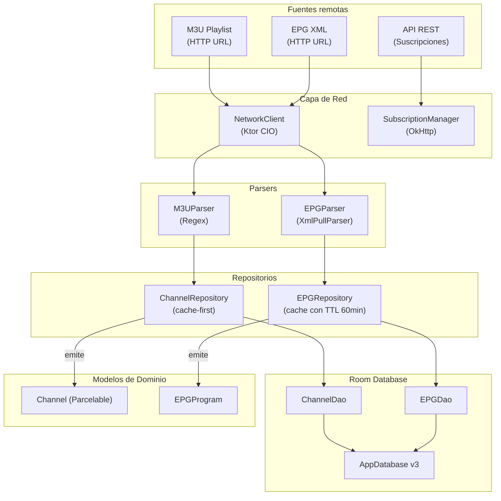
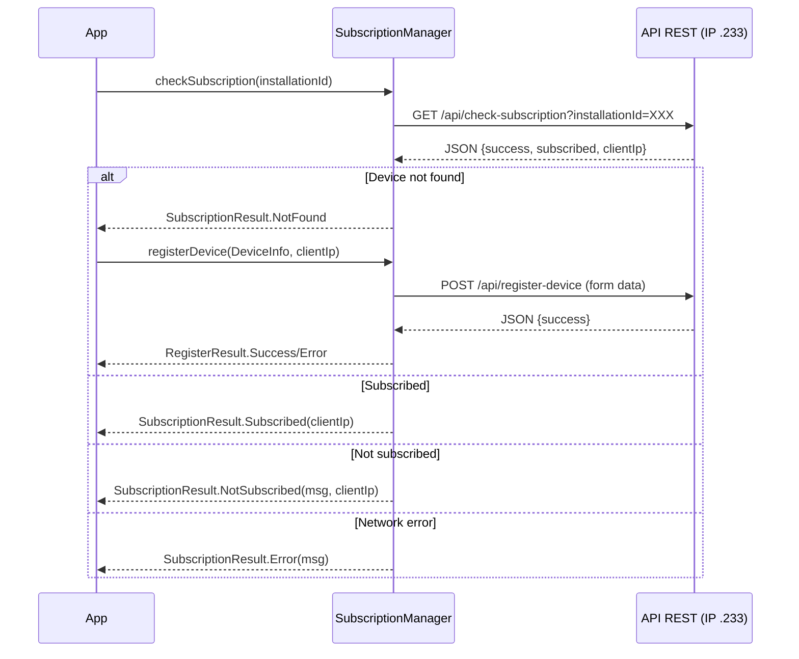
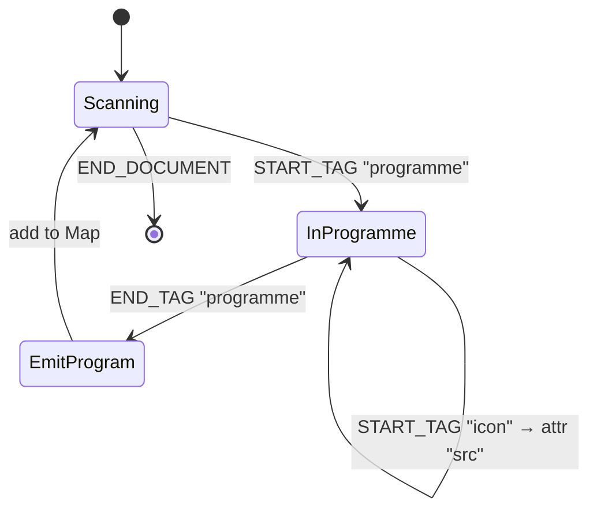
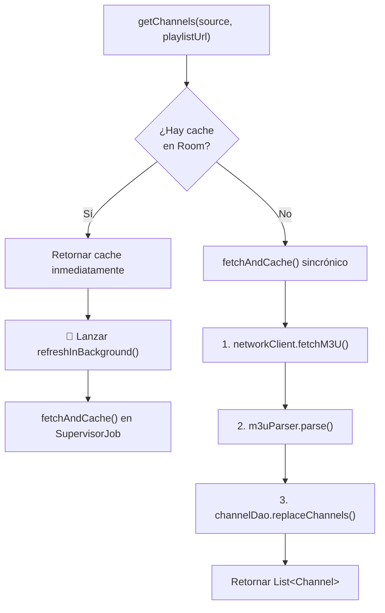
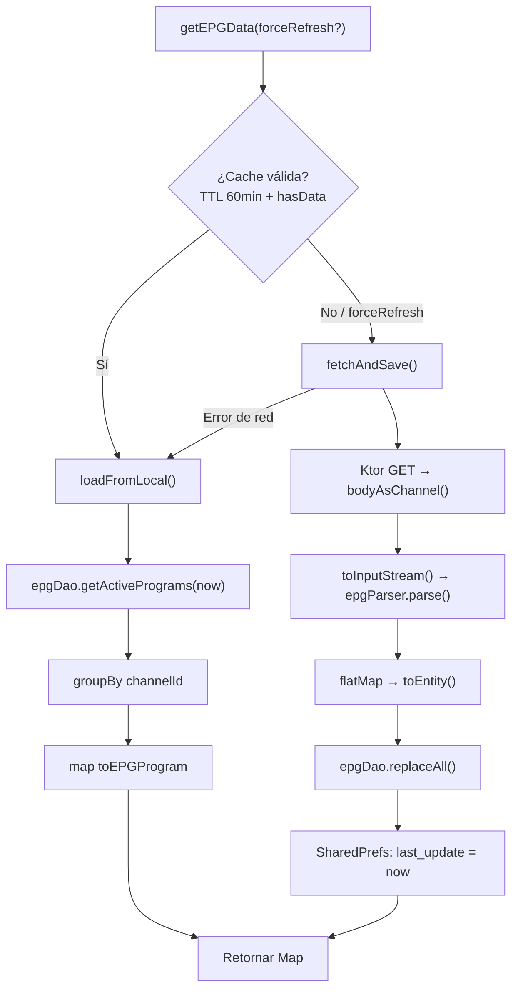
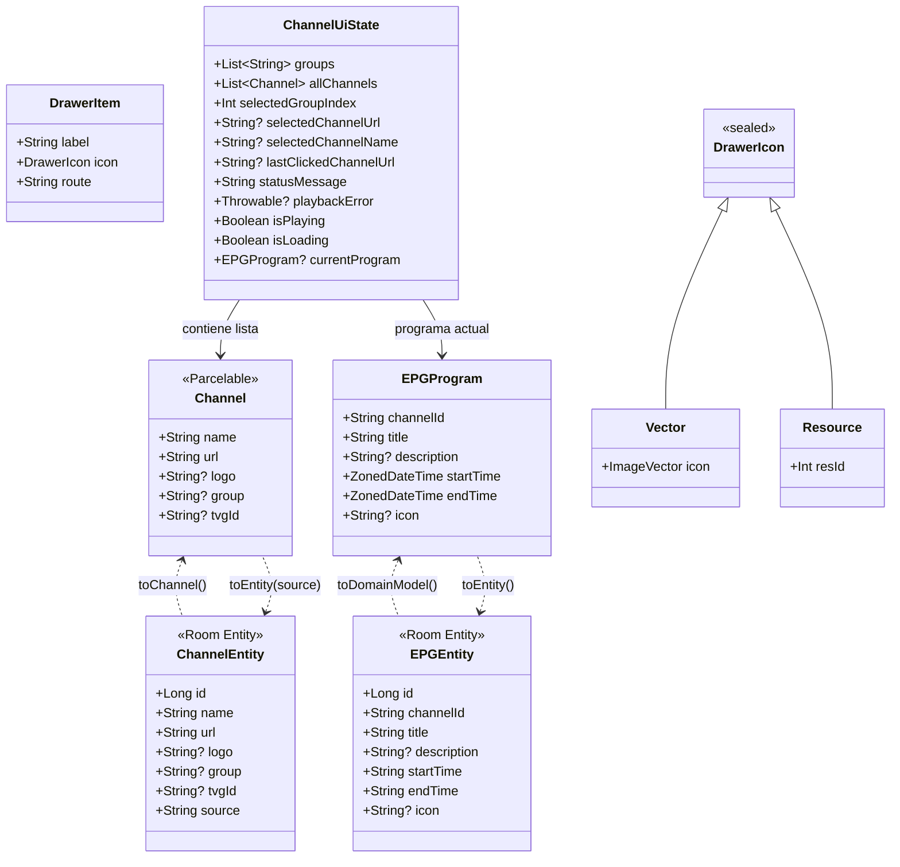
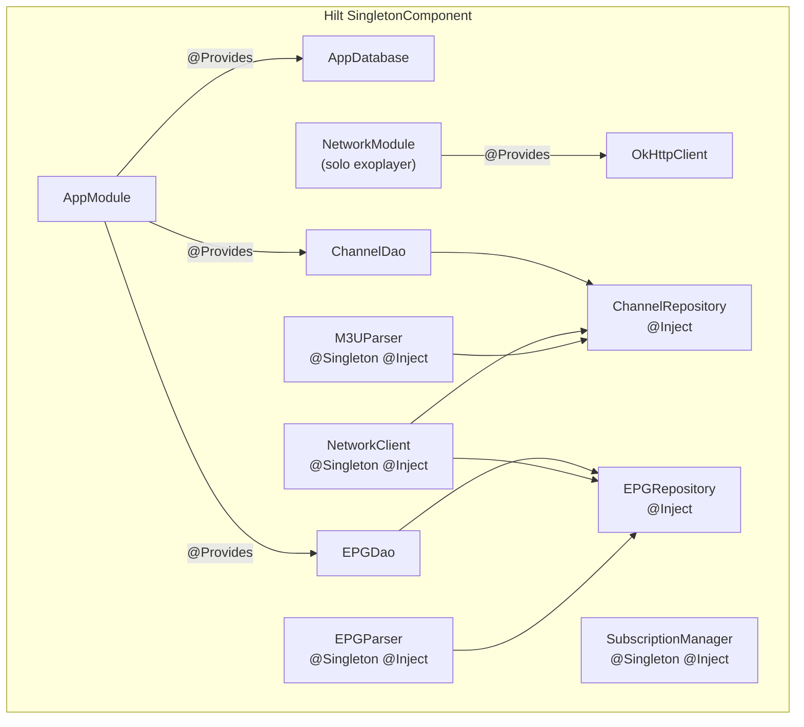
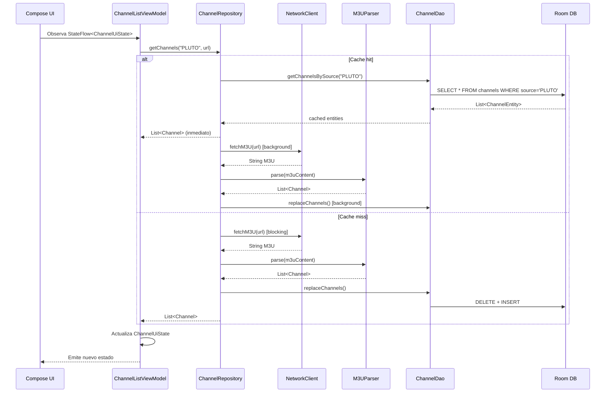

# SNAPSHOT TÉCNICO: ETAPA 2 — Capa de Datos y Dominio (:core)

> **Módulo:** `:core` (`com.iptv.ccomate`)  
> **Tipo:** `com.android.library`  
> **Fecha de análisis:** 2026-04-04  
> **Status:** ✅ **100% Implementado**

---

## 1. Arquitectura General de la Capa de Datos

El módulo `:core` implementa una arquitectura de datos de **3 niveles** con estrategia **cache-first**:



---

## 2. Persistencia Room

### 2.1 AppDatabase

```kotlin
// Archivo: data/local/AppDatabase.kt
@Database(
    entities = [EPGEntity::class, ChannelEntity::class],
    version = 3,
    exportSchema = false
)
abstract class AppDatabase : RoomDatabase() {
    abstract fun epgDao(): EPGDao
    abstract fun channelDao(): ChannelDao
}
```

> [!WARNING]
> La base de datos usa `fallbackToDestructiveMigration(true)` en el `AppModule.kt`. Esto significa que **cualquier cambio de schema destruirá todos los datos existentes**. Es aceptable para una app IPTV (los datos se re-descargan), pero debe documentarse.

| Aspecto | Valor |
|---------|-------|
| Nombre DB | `ccomate_database` |
| Versión | 3 |
| Export Schema | `false` |
| Migración | Destructiva (fallback) |
| Entidades | `ChannelEntity`, `EPGEntity` |
| DAOs | `ChannelDao`, `EPGDao` |

### 2.2 ChannelEntity

```kotlin
// Archivo: data/local/ChannelEntity.kt
@Entity(tableName = "channels")
data class ChannelEntity(
    @PrimaryKey(autoGenerate = true) val id: Long = 0,
    val name: String,
    val url: String,
    val logo: String?,
    val group: String?,
    val tvgId: String?,
    val source: String  // "PLUTO" or "TDA"
)
```

| Columna | Tipo | Nullable | Descripción |
|---------|------|----------|-------------|
| `id` | `Long` | No | Auto-incremental PK |
| `name` | `String` | No | Nombre del canal |
| `url` | `String` | No | URL del stream (HTTP/HTTPS/UDP/RTP/RTSP) |
| `logo` | `String?` | Sí | URL del logotipo |
| `group` | `String?` | Sí | Categoría/grupo del canal |
| `tvgId` | `String?` | Sí | ID para enlazar con EPG |
| `source` | `String` | No | Discriminador: `"PLUTO"` o `"TDA"` |

> [!NOTE]
> El campo `source` actúa como **discriminador de tipo** para segmentar canales de distintas fuentes en la misma tabla. Todas las queries del DAO filtran por `source`.

### 2.3 EPGEntity

```kotlin
// Archivo: data/local/EPGEntity.kt
@Entity(
    tableName = "epg_programs",
    indices = [
        Index(value = ["channelId"]),
        Index(value = ["channelId", "endTime"])
    ]
)
data class EPGEntity(
    @PrimaryKey(autoGenerate = true) val id: Long = 0,
    val channelId: String,
    val title: String,
    val description: String?,
    val startTime: String,  // ISO 8601 string
    val endTime: String,    // ISO 8601 string
    val icon: String?
)
```

| Columna | Tipo | Índice | Descripción |
|---------|------|--------|-------------|
| `id` | `Long` | PK | Auto-incremental |
| `channelId` | `String` | ✅ Simple + ✅ Compuesto | ID del canal (enlace con `tvgId` de Channel) |
| `title` | `String` | — | Título del programa |
| `description` | `String?` | — | Sinopsis |
| `startTime` | `String` | — | Inicio en ISO 8601 |
| `endTime` | `String` | ✅ Compuesto | Fin en ISO 8601 |
| `icon` | `String?` | — | URL de ícono del programa |

> [!IMPORTANT]
> Las fechas se almacenan como **strings ISO 8601** en lugar de timestamps numéricos. Esto permite comparación lexicográfica directa en SQLite (`endTime > :currentTime`), pero es menos eficiente que usar `Long`. La indexación compuesta `[channelId, endTime]` optimiza las queries de "programas activos para un canal".

### 2.4 ChannelDao

```kotlin
// Archivo: data/local/ChannelDao.kt
@Dao
interface ChannelDao {
    // Filtrado por fuente (PLUTO/TDA)
    suspend fun getChannelsBySource(source: String): List<ChannelEntity>

    // Upsert masivo
    @Insert(onConflict = REPLACE)
    suspend fun insertAll(channels: List<ChannelEntity>)

    // Borrado por fuente
    suspend fun deleteBySource(source: String)

    // Reemplazo atómico (DELETE + INSERT en @Transaction)
    @Transaction
    suspend fun replaceChannels(source: String, channels: List<ChannelEntity>)

    // Conteo para verificar cache
    suspend fun getCountBySource(source: String): Int
}
```

**Patrón clave:** `replaceChannels()` usa `@Transaction` para garantizar atomicidad: primero borra todos los canales de una fuente y luego inserta la nueva lista completa. Esto evita datos huérfanos.

### 2.5 EPGDao

```kotlin
// Archivo: data/local/EPGDao.kt
@Dao
interface EPGDao {
    // Programación futura de un canal (limit 20)
    suspend fun getProgramsForChannel(channelId: String, currentTime: String, limit: Int = 20)

    // Programas activos AHORA de todos los canales
    suspend fun getActivePrograms(currentTime: String): List<EPGEntity>

    // Upsert masivo
    @Insert(onConflict = REPLACE)
    suspend fun insertAll(programs: List<EPGEntity>)

    // Borrado total
    suspend fun deleteAll()

    // Conteo para verificar cache
    suspend fun getCount(): Int

    // Reemplazo atómico total
    @Transaction
    suspend fun replaceAll(programs: List<EPGEntity>)
}
```

**Queries críticas:**
- `getProgramsForChannel`: Devuelve hasta 20 programas **futuro o en curso** para un canal, ordenados cronológicamente.
- `getActivePrograms`: Devuelve programas **en emisión ahora** (`startTime <= now < endTime`) de TODOS los canales, util para mostrar "ahora en TV".

---

## 3. Capa de Red

### 3.1 NetworkClient (Ktor CIO)

```kotlin
// Archivo: data/NetworkClient.kt
@Singleton
class NetworkClient @Inject constructor() {
    val client = HttpClient(CIO) {
        install(HttpTimeout) {
            requestTimeoutMillis = 30_000
            connectTimeoutMillis = 10_000
            socketTimeoutMillis  = 30_000
        }
        engine {
            maxConnectionsCount = 4
        }
    }

    suspend fun fetchM3U(url: String): String {
        return client.get(url).bodyAsText()
    }
}
```

| Configuración | Valor | Propósito |
|---------------|-------|-----------|
| **Engine** | CIO (Coroutine I/O) | Motor asíncrono nativo de Ktor |
| `requestTimeoutMillis` | 30s | Timeout total del request |
| `connectTimeoutMillis` | 10s | Timeout de conexión TCP |
| `socketTimeoutMillis` | 30s | Timeout de lectura del socket |
| `maxConnectionsCount` | 4 | Limita conexiones simultáneas (dispositivos de bajo recurso) |

> [!NOTE]
> El `NetworkClient` expone su `client` como propiedad pública. Esto es usado por `EPGRepository` para streaming directo del XML (`bodyAsChannel().toInputStream()`), evitando cargar el XML completo en memoria.

### 3.2 NetworkModule (solo flavor `exoplayer`)

```kotlin
// Archivo: core/src/exoplayer/.../di/NetworkModule.kt
@Module
@InstallIn(SingletonComponent::class)
object NetworkModule {
    @Provides @Singleton
    fun provideOkHttpClient(): OkHttpClient =
        OkHttpClient.Builder()
            .connectTimeout(15, TimeUnit.SECONDS)
            .readTimeout(30, TimeUnit.SECONDS)
            .build()
}
```

**Propósito:** Provee un `OkHttpClient` **singleton** compartido para que `media3-datasource-okhttp` no cree un pool de hilos por cada stream de video. Esto es crítico en dispositivos TV con ~9MB heap.

> [!TIP]
> Este módulo Hilt solo existe en el flavor `exoplayer`. En el flavor `vlc`, LibVLC maneja sus propias conexiones de red, por lo que no necesita OkHttp.

### 3.3 SubscriptionManager (OkHttp directo)

```kotlin
// Archivo: util/SubscriptionManager.kt
@Singleton
class SubscriptionManager @Inject constructor() {
    // OkHttpClient propio (separado del de Media3)
    private val client = OkHttpClient.Builder()...

    suspend fun checkSubscription(installationId: String): SubscriptionResult
    suspend fun registerDevice(deviceInfo: DeviceInfo, clientIp: String?): RegisterResult
}
```

**Flujo de suscripción:**



**Tipos sellados para resultados:**

| Sealed Class | Variantes | Datos |
|-------------|-----------|-------|
| `SubscriptionResult` | `Subscribed` | `clientIp: String?` |
| | `NotSubscribed` | `message`, `clientIp` |
| | `NotFound` | (ninguno) |
| | `Error` | `message` |
| `RegisterResult` | `Success` | (ninguno) |
| | `Error` | `message` |

> [!WARNING]
> `SubscriptionManager` crea su propio `OkHttpClient` en lugar de inyectar el del `NetworkModule`. Esto resulta en **dos pools de hilos OkHttp separados** cuando se usa el flavor `exoplayer`. Es un candidato a refactorización.

---

## 4. Parsers

### 4.1 M3UParser

```kotlin
// Archivo: data/M3UParser.kt
@Singleton
class M3UParser @Inject constructor() {
    // Regex precompilados (reutilizados como singleton)
    private val nameRegex     = Regex(".*,(.*)")
    private val logoRegex     = Regex("""tvg-logo="(.*?)"""")
    private val groupRegex    = Regex("""group-title="(.*?)"""")
    private val channelIdRegex = Regex("""channel-id="(.*?)"""")
    private val tvgIdRegex    = Regex("""tvg-id="(.*?)"""")

    fun parse(m3uContent: String): List<Channel>
}
```

**Algoritmo de parsing línea por línea:**

```
Para cada línea en el archivo M3U:
  SI empieza con "#EXTINF":
    → Extraer: nombre, logo, grupo, tvgId (channel-id > tvg-id)
  SI NO empieza con "#" Y contiene "://":
    → Es URL de stream → crear Channel con metadatos acumulados
```

**Ejemplo de entrada M3U:**
```
#EXTM3U
#EXTINF:-1 tvg-id="canal1" tvg-logo="http://logo.png" group-title="Deportes",ESPN HD
http://stream.example.com/espn.m3u8
```

**Detalles de la extracción:**

| Campo | Regex | Fallback |
|-------|-------|----------|
| `name` | `.*,(.*)` (después de la última coma) | `"Sin nombre"` |
| `logo` | `tvg-logo="(.*?)"` | `null` |
| `group` | `group-title="(.*?)"` | `null` |
| `tvgId` | `channel-id="(.*?)"` → si no: `tvg-id="(.*?)"` | `null` |

> [!NOTE]
> El parser prioriza `channel-id` sobre `tvg-id` para el enlace con EPG. La URL acepta **cualquier protocolo** (`http://`, `https://`, `udp://`, `rtp://`, `rtsp://`), lo cual es esencial para IPTV multicast.

### 4.2 EPGParser (XMLTV)

```kotlin
// Archivo: data/EPGParser.kt
@Singleton
class EPGParser @Inject constructor() {
    private val DATE_FORMATTER = DateTimeFormatter.ofPattern("yyyyMMddHHmmss Z", Locale.US)

    fun parse(inputStream: InputStream): Map<String, List<EPGProgram>>
}
```

**Algoritmo de parsing (XmlPullParser):**



**Formato de fecha XMLTV:** `20260112065500 -0300`  
→ parseado con `DateTimeFormatter.ofPattern("yyyyMMddHHmmss Z")` → `ZonedDateTime`

**Estructura de salida:** `Map<channelId, List<EPGProgram>>`  
- Agrupa todos los programas por ID de canal.
- Utiliza `InputStream` para parseo streaming (no carga todo el XML en memoria).

**Manejo de errores:**
- Error en fecha individual → `Log.w()` + skip del programa (no rompe el parsing).
- Error fatal de XML → `Log.e()` + retorna mapa vacío.

---

## 5. Repositorios

### 5.1 ChannelRepository

```kotlin
// Archivo: data/ChannelRepository.kt
class ChannelRepository @Inject constructor(
    private val channelDao: ChannelDao,
    private val networkClient: NetworkClient,
    private val m3uParser: M3UParser
)
```

**Estrategia: Cache-first con refresh en background**



**Métodos públicos:**

| Método | Comportamiento |
|--------|---------------|
| `getChannels(source, url)` | Cache-first. Si hay datos en Room: retorna inmediato + refresca en background |
| `forceRefresh(source, url)` | Ignora cache, descarga siempre de red. Usado desde pantalla de Settings |

**Transformaciones Entity ↔ Domain:**
```kotlin
// Entity → Domain
private fun ChannelEntity.toChannel() = Channel(name, url, logo, group, tvgId)

// Domain → Entity
private fun Channel.toEntity(source: String) = ChannelEntity(
    name = name, url = url, logo = logo, group = group,
    tvgId = tvgId, source = source
)
```

> [!IMPORTANT]
> El `repositoryScope` usa `SupervisorJob()` para que fallos en el refresh de background no cancelen otras coroutines. Los errores se silencian con `Log.w()`.

### 5.2 EPGRepository

```kotlin
// Archivo: data/EPGRepository.kt
class EPGRepository @Inject constructor(
    @ApplicationContext private val context: Context,
    private val epgDao: EPGDao,
    private val networkClient: NetworkClient,
    private val epgParser: EPGParser
)
```

**Estrategia: Cache con TTL de 60 minutos**



| Detalle | Valor |
|---------|-------|
| **TTL** | 60 minutos (`CACHE_TIMEOUT_MS`) |
| **Persistence del TTL** | `SharedPreferences("epg_prefs")` → key `last_update` |
| **URL EPG** | `AppConfig.EPG_URL` → `http://10.224.24.232:8081/epg.xml` |
| **Fallback en error** | Retorna datos locales (aunque estén expirados) |
| **Streaming** | Usa `bodyAsChannel().toInputStream()` para parseo sin cargar XML completo en memoria |

**Transformaciones Entity ↔ Domain:**
```kotlin
// Entity → Domain
EPGEntity.toDomainModel() → EPGProgram(
    channelId, title, description,
    startTime = ZonedDateTime.parse(this.startTime),  // ISO 8601 → ZonedDateTime
    endTime   = ZonedDateTime.parse(this.endTime),
    icon
)

// Domain → Entity
EPGProgram.toEntity() → EPGEntity(
    channelId, title, description,
    startTime = this.startTime.toString(),  // ZonedDateTime → ISO 8601
    endTime   = this.endTime.toString(),
    icon
)
```

---

## 6. Modelos de Dominio

### 6.1 Jerarquía de Modelos



### 6.2 ChannelUiState — Estado centralizado de la UI

```kotlin
data class ChannelUiState(
    val groups: List<String> = emptyList(),         // Grupos/categorías disponibles
    val allChannels: List<Channel> = emptyList(),   // Todos los canales cargados
    val selectedGroupIndex: Int = 0,                // Índice del grupo seleccionado
    val selectedChannelUrl: String? = null,          // URL del canal en reproducción
    val selectedChannelName: String? = null,          // Nombre del canal en reproducción
    val lastClickedChannelUrl: String? = null,        // Para detección de doble-click
    val statusMessage: String = "Inicializando...",   // Mensaje de estado para UI
    val playbackError: Throwable? = null,             // Error de reproducción
    val isPlaying: Boolean = false,                   // ¿Está reproduciendo?
    val isLoading: Boolean = false,                   // ¿Está cargando canales?
    val currentProgram: EPGProgram? = null             // Programa EPG actual
)
```

> [!IMPORTANT]
> `ChannelUiState` es un **estado unificado** que combina datos de canales, estado de reproducción, EPG y errores. Es el principal vehículo de comunicación `:core` → `:app-tv`/`:app-mobile` via `StateFlow`.

### 6.3 DrawerItem — Modelo para navegación lateral

```kotlin
sealed class DrawerIcon {
    data class Vector(val icon: ImageVector) : DrawerIcon()  // Íconos Material
    data class Resource(val resId: Int) : DrawerIcon()       // Drawables/SVGs propios
}

data class DrawerItem(
    val label: String,   // Texto visible
    val icon: DrawerIcon, // Ícono (vector o recurso)
    val route: String     // Ruta de navegación asociada
)
```

---

## 7. Utilidades del Core

### 7.1 AppConfig — URLs y constantes centralizadas

```kotlin
object AppConfig {
    // ── Servidor de Contenido (IP .232) ──
    CONTENT_SERVER  = "http://10.224.24.232:8081"
    BANNER_URL      = "$CONTENT_SERVER/iptvbanner.png"
    TDA_PLAYLIST_URL = "$CONTENT_SERVER/tda.m3u"
    PLUTO_PLAYLIST_URL = "$CONTENT_SERVER/tuner-1-playlist.m3u"
    PLUTO_PLAYLIST_GROK_URL = "$CONTENT_SERVER/playlist.m3u"
    EPG_URL         = "$CONTENT_SERVER/epg.xml"

    // ── Servidor de API (IP .233) ──
    API_BASE_URL    = "http://10.224.24.233:8000/api"
    REGISTER_DEVICE_URL = "$API_BASE_URL/register-device"
    CHECK_SUBSCRIPTION_URL = "$API_BASE_URL/check-subscription"

    // ── Seguridad ──
    VIDEO_REFERER   = "https://ccomate.iptv.com"
    VIDEO_ORIGIN    = "https://ccomate.iptv.com"

    // ── Defaults ──
    DEFAULT_CHANNEL_LOGO = "https://..."  // Placeholder genérico
}
```

> [!CAUTION]
> Las IPs del servidor de contenido (`10.224.24.232`) y API (`10.224.24.233`) están **hardcodeadas**. Un cambio de infraestructura requiere recompilación. Candidato a externalizar vía `BuildConfig` o remote config.

**Topología de red inferida:**

```
┌──────────────────────────────────────────────────────────┐
│  Red interna 10.224.24.0/24                              │
│                                                          │
│  .232:8081 ─── Servidor de Contenido                     │
│     ├── /iptvbanner.png      (banner de la app)          │
│     ├── /tda.m3u             (playlist TDA Argentina)    │
│     ├── /tuner-1-playlist.m3u (playlist Pluto TV)        │
│     ├── /playlist.m3u        (playlist alternativa)      │
│     └── /epg.xml             (guía de programación)      │
│                                                          │
│  .233:8000 ─── API REST (Laravel?)                       │
│     ├── /api/register-device   (POST: registrar device)  │
│     └── /api/check-subscription (GET: verificar sub.)    │
└──────────────────────────────────────────────────────────┘
```

### 7.2 DeviceIdentifier — Identificación del dispositivo

```kotlin
data class DeviceInfo(
    val installationId: String,  // UUID persistente
    val localIp: String?,        // IP local del dispositivo
    val deviceModel: String,     // "Samsung SM-T500"
    val dni: String? = null,     // DNI del usuario (registro)
    val name: String? = null,    // Nombre del usuario
    val phone: String? = null    // Teléfono del usuario
)

object DeviceIdentifier {
    // UUID generado una vez y persistido en SharedPreferences("DevicePrefs")
    fun getInstallationId(context: Context): String

    // IP local vía NetworkInterface (first non-loopback IPv4)
    private fun getLocalIpAddress(): String?

    // "${Build.MANUFACTURER} ${Build.MODEL}"
    private fun getDeviceModel(): String
}
```

### 7.3 FullscreenUtils — CompositionLocal compartido

```kotlin
// Archivo: util/FullscreenUtils.kt
val LocalFullscreenState =
    compositionLocalOf<MutableState<Boolean>> { error("No FullscreenState provided") }
```

> [!IMPORTANT]
> Este `CompositionLocal` es el mecanismo que permite a los componentes de video (en `:app-tv` y `:app-mobile`) leer y modificar el estado fullscreen **sin necesidad de un ViewModel**. Lo define `:core` y lo proveen los `MainActivity` de cada app.

### 7.4 TimeUtils — Validación de reloj del sistema

```kotlin
object TimeUtils {
    fun isSystemTimeValid(): Boolean  // true si año >= 2023
    fun getSystemTimeMessage(): String // "Hora actual del sistema: ..."
}
```

**Propósito:** Verificar que el reloj no esté desconfigurado en dispositivos TV (sin RTC o sin batería CMOS), ya que un reloj incorrecto rompería las comparaciones de EPG por fecha.

### 7.5 SvgUtils — Carga de SVG con Coil

```kotlin
@Composable
fun rememberSvgPainter(resourceId: Int): Painter {
    // ImageLoader con SvgDecoder.Factory()
    // Retorna Painter para uso en Image()
}
```

---

## 8. Estado de Hilt (Capa de Datos)

### 8.1 AppModule — Provider principal

```kotlin
@Module @InstallIn(SingletonComponent::class)
object AppModule {
    @Provides @Singleton fun provideAppDatabase(ctx): AppDatabase
    @Provides @Singleton fun provideChannelDao(db): ChannelDao
    @Provides @Singleton fun provideEPGDao(db): EPGDao
}
```

### 8.2 Grafo de inyección completo (datos)



> [!NOTE]
> `ChannelRepository` y `EPGRepository` **no** tienen anotación `@Singleton`, lo que significa que Hilt crea una nueva instancia cada vez que se inyectan. En la práctica, como solo se inyectan en ViewModels (que son `@HiltViewModel` scoped), se crea una instancia por ViewModel. El `repositoryScope` en `ChannelRepository` con `SupervisorJob()` sobrevive al scope del ViewModel, lo cual podría causar leaks si el ViewModel se destruye mientras hay un refresh en background.

---

## 9. Flujo completo de datos: De la red a la UI



---

## 10. Observaciones Críticas

1. **Dos clientes HTTP paralelos:** `NetworkClient` (Ktor CIO) para descargar M3U/EPG y `SubscriptionManager` con su propio `OkHttpClient` para la API. Más un tercer `OkHttpClient` inyectado por `NetworkModule` para Media3. Son **3 pools de conexiones HTTP** en total.

2. **Repositorios sin `@Singleton`:** `ChannelRepository` y `EPGRepository` se re-instancian por cada ViewModel. El `SupervisorJob` del `ChannelRepository` no se cancela al destruir el ViewModel.

3. **Fechas como strings en Room:** Funciona correctamente gracias a ISO 8601 + comparación lexicográfica, pero las queries son más lentas que con timestamps `Long` indexados.

4. **IPs hardcodeadas:** Las URLs de servidores están en un `object AppConfig` sin mecanismo de configuración remota o build flavors por entorno.

5. **Fallback resiliente en EPG:** Si la descarga de EPG falla, el repo sirve datos locales expirados en vez de un error. Buena práctica para UX de IPTV.

6. **Streaming XML:** El EPG se parsea vía `InputStream` streaming (no se carga en RAM), lo cual es crítico para archivos XML de guías de programación que pueden ser de varios MB.

---

> **Etapa 2 completada.** El siguiente paso es la **Etapa 3: Lógica de Negocio y Estado** donde analizaré los ViewModels y cómo se gestiona el estado de reproducción compartido.
