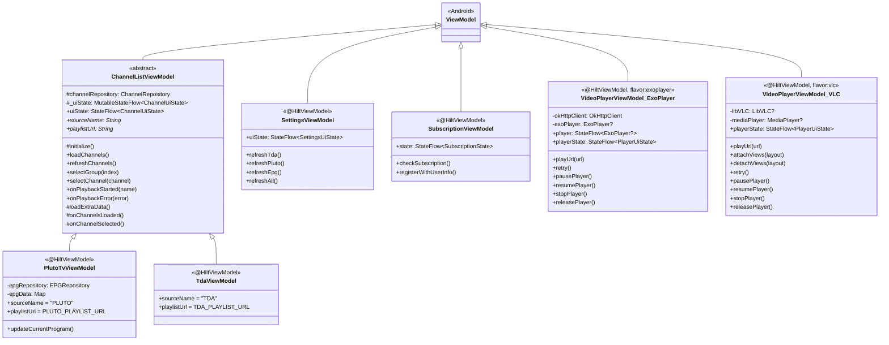
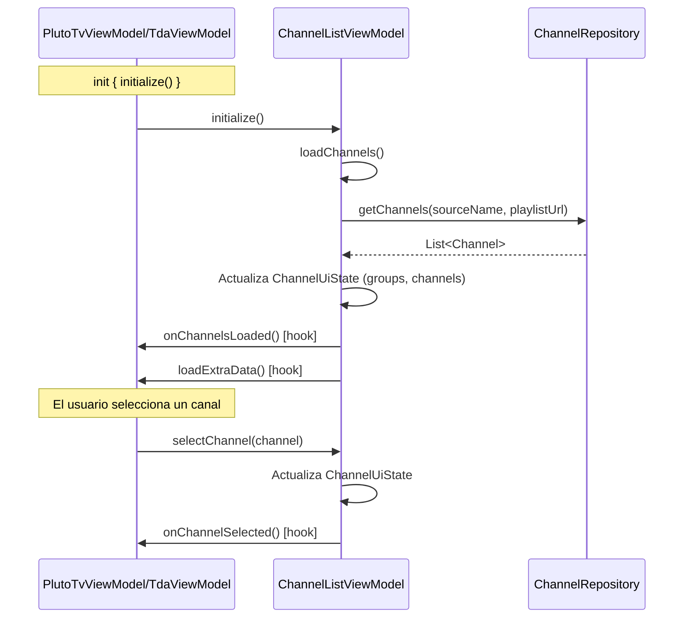
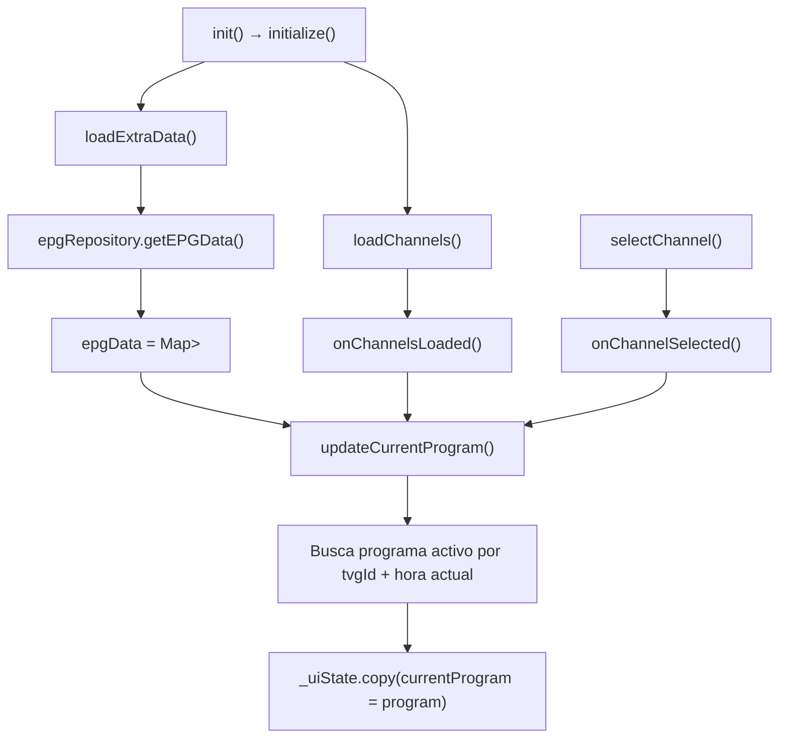
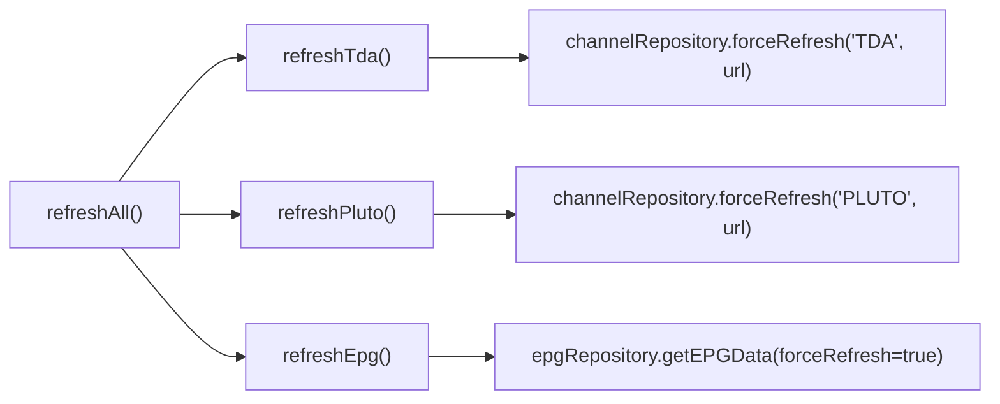
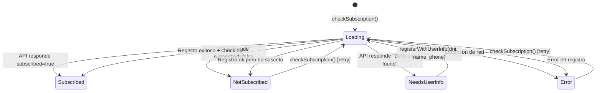
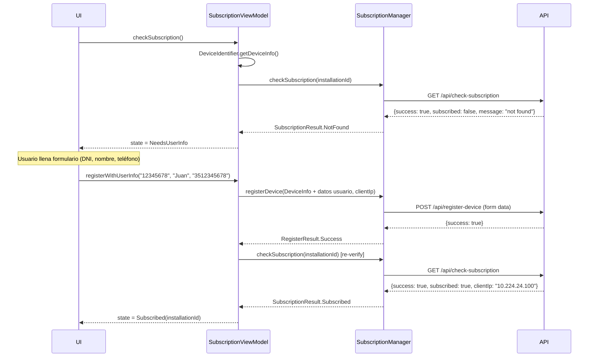
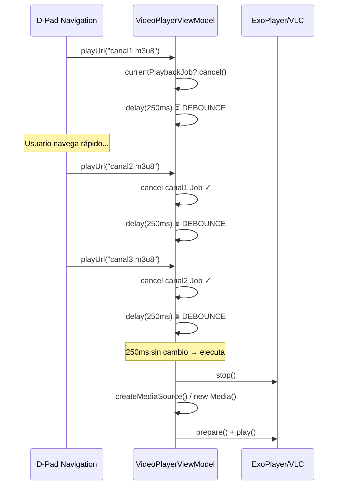
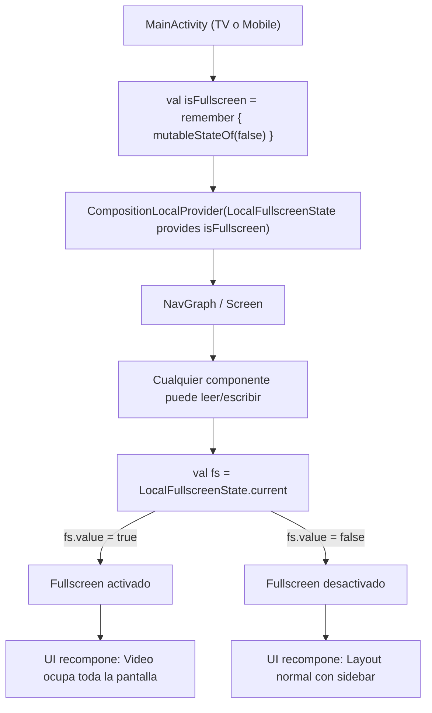
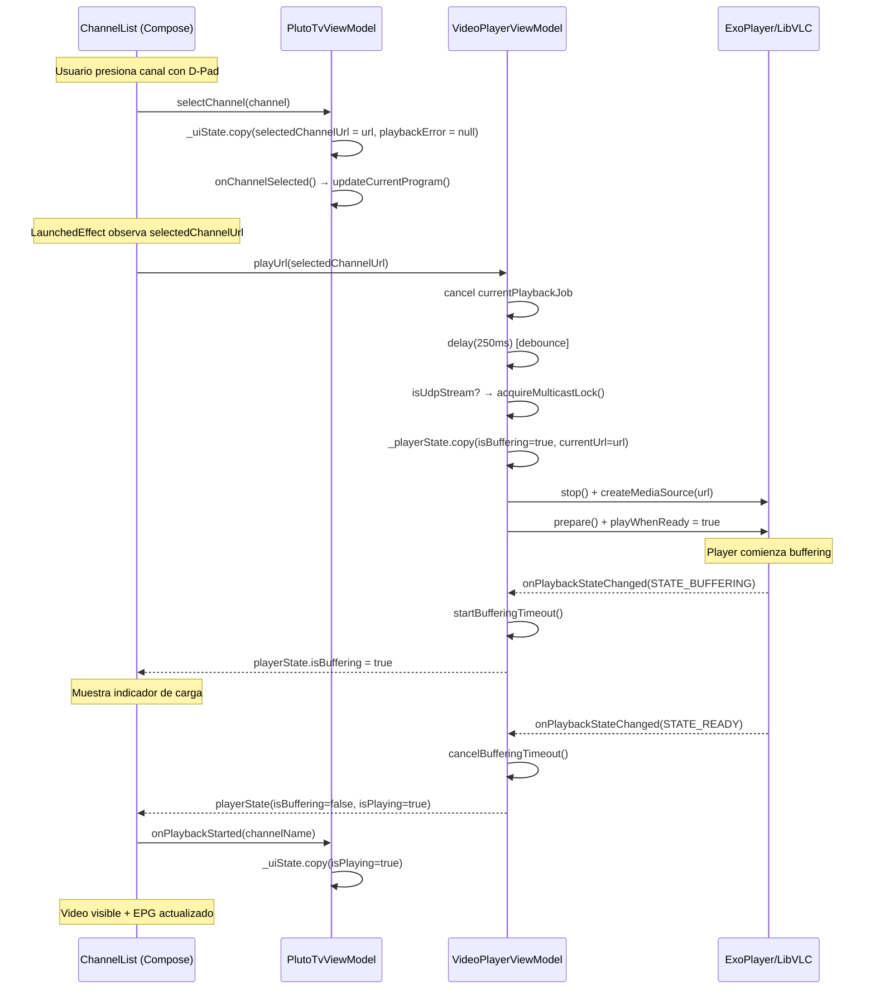
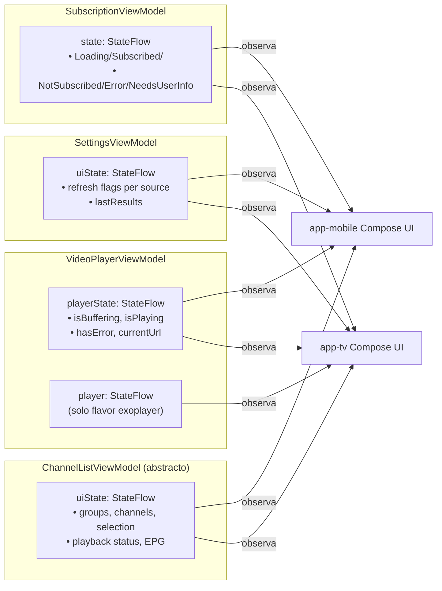

# SNAPSHOT TÉCNICO: ETAPA 3 — Lógica de Negocio y Estado

> **Módulo:** `:core` (ViewModels compartidos)  
> **Flavors:** `exoplayer` y `vlc` (VideoPlayerViewModel)  
> **Fecha de análisis:** 2026-04-04  
> **Status:** ✅ **100% Implementado**

---

## 1. Arquitectura de ViewModels

El proyecto implementa una jerarquía de ViewModels con un **patrón Template Method** para la gestión de canales:



### Inventario de ViewModels

| ViewModel | Scope | StateFlow | Fuente de datos |
|-----------|-------|-----------|----------------|
| `ChannelListViewModel` | — (abstract) | `ChannelUiState` | `ChannelRepository` |
| `PlutoTvViewModel` | `@HiltViewModel` | hereda `ChannelUiState` | `ChannelRepository` + `EPGRepository` |
| `TdaViewModel` | `@HiltViewModel` | hereda `ChannelUiState` | `ChannelRepository` |
| `SettingsViewModel` | `@HiltViewModel` | `SettingsUiState` | `ChannelRepository` + `EPGRepository` |
| `SubscriptionViewModel` | `@HiltViewModel` | `SubscriptionState` | `SubscriptionManager` |
| `VideoPlayerViewModel` | `@HiltViewModel` | `PlayerUiState` + `StateFlow<ExoPlayer?>` | Media3 ExoPlayer *(flavor exoplayer)* |
| `VideoPlayerViewModel` | `@HiltViewModel` | `PlayerUiState` | LibVLC *(flavor vlc)* |

---

## 2. ChannelListViewModel — Template Method para fuentes IPTV

### 2.1 Patrón Template Method



### 2.2 Hooks extendidos por subclases

| Hook | `PlutoTvViewModel` | `TdaViewModel` |
|------|-------|------|
| `loadExtraData()` | Carga EPG desde `EPGRepository` | (no-op, hereda default) |
| `onChannelsLoaded()` | `updateCurrentProgram()` | (no-op) |
| `onChannelSelected()` | `updateCurrentProgram()` | (no-op) |

### 2.3 Deduplicación de cargas

```kotlin
private var loadJob: Job? = null

fun loadChannels() {
    if (loadJob?.isActive == true) return  // Evita fetches duplicados
    loadJob = viewModelScope.launch { ... }
}
```

> [!NOTE]
> El campo `loadJob` previene que `init{}` y `LaunchedEffect(Unit)` disparen cargas simultáneas — un caso real cuando Compose recompone rápidamente.

### 2.4 Gestión de selección de canales

| Método | Efecto en `ChannelUiState` |
|--------|---------------------------|
| `selectGroup(index)` | Actualiza `selectedGroupIndex` |
| `selectChannel(channel)` | Actualiza `selectedChannelUrl`, `selectedChannelName`, limpia `playbackError` |
| `updateLastClickedChannel(url)` | Actualiza `lastClickedChannelUrl` (detección de doble-click) |
| `onPlaybackStarted(name)` | `isPlaying = true`, limpia error |
| `onPlaybackError(error)` | `isPlaying = false`, setea `playbackError` |
| `refreshChannels()` | `forceRefresh()` desde red, mantiene selección si canal aún existe |

---

## 3. PlutoTvViewModel — EPG integrado

### 3.1 Flujo de EPG



### 3.2 updateCurrentProgram() — Enlace Canal ↔ EPG

```kotlin
fun updateCurrentProgram() {
    val state = _uiState.value
    val selectedChannel = state.allChannels.firstOrNull { it.url == state.selectedChannelUrl }

    val program = selectedChannel?.tvgId?.let { tvgId ->
        epgData[tvgId]
    }?.find { p ->
        val now = ZonedDateTime.now()
        now.isAfter(p.startTime) && now.isBefore(p.endTime)
    }

    _uiState.value = _uiState.value.copy(currentProgram = program)
}
```

**Cadena de enlace:**
```
Channel.url → match selectedChannelUrl → Channel.tvgId → EPG Map key → List<EPGProgram> → filtro por hora actual → programa en emisión
```

> [!IMPORTANT]
> El enlace entre canales y EPG se hace por `tvgId` (extraído del M3UParser con prioridad `channel-id` > `tvg-id`). Si un canal no tiene `tvgId`, nunca tendrá información EPG.

---

## 4. TdaViewModel — Implementación mínima

```kotlin
@HiltViewModel
class TdaViewModel @Inject constructor(
    channelRepository: ChannelRepository
) : ChannelListViewModel(channelRepository) {
    override val sourceName = "TDA"
    override val playlistUrl = AppConfig.TDA_PLAYLIST_URL

    init { initialize() }
}
```

> TDA (Televisión Digital Abierta de Argentina) no implementa EPG en esta versión, por lo que no sobreescribe ningún hook. Es el ejemplo mínimo del patrón Template Method.

---

## 5. SettingsViewModel — Refresh manual de datos

### 5.1 Estado propio

```kotlin
data class RefreshResult(
    val source: String,      // "TDA", "PLUTO", "EPG"
    val success: Boolean,
    val channelCount: Int = 0,
    val errorMessage: String? = null
)

data class SettingsUiState(
    val isRefreshingTda: Boolean = false,
    val isRefreshingPluto: Boolean = false,
    val isRefreshingEpg: Boolean = false,
    val lastResults: List<RefreshResult> = emptyList()
)
```

### 5.2 Operaciones de refresh



> [!NOTE]
> `refreshAll()` lanza las 3 coroutines en **paralelo** (cada una en su propio `viewModelScope.launch`). Los flags de loading son independientes para que la UI muestre spinners individules. Los resultados se acumulan en `lastResults` reemplazando el resultado anterior del mismo `source`.

---

## 6. SubscriptionViewModel — Máquina de estados de suscripción

### 6.1 Estados sellados



### 6.2 Flujo de registro de dispositivo



> [!IMPORTANT]
> Después de un registro exitoso, el ViewModel **vuelve a verificar la suscripción** con una segunda llamada a `checkSubscription()`. Esto valida que el backend procesó correctamente el registro antes de dejar pasar al usuario.

---

## 7. VideoPlayerViewModel — Comparación ExoPlayer vs VLC

### 7.1 API pública compartida (contrato implícito)

Ambas implementaciones exponen la misma API pública:

| Método/Propiedad | ExoPlayer | VLC | Descripción |
|-----------|-----------|-----|-------------|
| `playerState: StateFlow<PlayerUiState>` | ✅ | ✅ | Estado de reproducción |
| `player: StateFlow<ExoPlayer?>` | ✅ | ❌ | Referencia al player (solo ExoPlayer) |
| `playUrl(videoUrl)` | ✅ | ✅ | Reproduce URL |
| `retry()` | ✅ | ✅ | Reintenta última URL |
| `pausePlayer()` | ✅ | ✅ | Pausa |
| `resumePlayer()` | ✅ | ✅ | Reanuda |
| `stopPlayer()` | ✅ | ✅ | Detiene |
| `releasePlayer()` | ✅ | ✅ | Libera recursos |
| `attachViews(layout)` | ❌ | ✅ | Vincula VLCVideoLayout |
| `detachViews(layout)` | ❌ | ✅ | Desvincula VLCVideoLayout |

> [!WARNING]
> La API no está definida por una interfaz formal. Las dos implementaciones tienen el mismo nombre de clase `VideoPlayerViewModel` pero **no comparten un tipo base** más allá de `ViewModel`. El compilador selecciona la implementación correcta por el source set del flavor. Cualquier divergencia en la API requiere revisión manual cruzada.

### 7.2 PlayerUiState — Estado compartido

```kotlin
// Definido IDENTICAMENTE en ambos flavors
data class PlayerUiState(
    val isBuffering: Boolean = false,
    val isPlaying: Boolean = false,
    val hasError: Boolean = false,
    val errorMessage: String = "",
    val currentUrl: String? = null
)
```

### 7.3 Patrón de pre-calentamiento (init{})

````carousel
**ExoPlayer:**
```kotlin
init {
    // Pre-construir ExoPlayer en Main thread
    viewModelScope.launch(Dispatchers.Main.immediate) {
        buildPlayer()  // ExoPlayer.Builder + TrackSelector + LoadControl
    }
    // Pre-adquirir MulticastLock en IO
    viewModelScope.launch(Dispatchers.IO) {
        acquireMulticastLock()
    }
}
```
<!-- slide -->
**VLC:**
```kotlin
init {
    // Pre-cargar LibVLC + MediaPlayer en IO thread
    viewModelScope.launch(Dispatchers.IO) {
        getOrCreateLibVLC()    // Carga binarios nativos C++ (~30-50MB)
        getOrCreateMediaPlayer()
        acquireMulticastLock()
    }
}
```
````

| Aspecto | ExoPlayer | VLC |
|---------|-----------|-----|
| **Thread de init** | `Main.immediate` (obligatorio para ExoPlayer) | `Dispatchers.IO` (carga nativa pesada) |
| **Tiempo estimado** | ~50-200ms | ~200-500ms (carga .so) |
| **Propósito** | Eliminar Davey de ~800-1500ms al primer canal | Evitar bloqueo de UI al cargar librerías nativas |

### 7.4 Flujo de playUrl() — Optimización de debounce



> [!TIP]
> El debounce de 250ms es **crítico para TV**: al navegar con D-Pad por la lista de canales, el foco se mueve rápido y cada cambio de foco dispara `selectChannel()` → `playUrl()`. Sin debounce, ExoPlayer/VLC intentaría preparar y decodificar cada canal intermedio, saturando el decoder HW y la red.

### 7.5 Manejo de protocolos de streaming

````carousel
**ExoPlayer — createMediaSource():**
```kotlin
val scheme = Uri.parse(videoUrl).scheme?.lowercase()

when {
    scheme == "udp" || scheme == "rtp" →
        ProgressiveMediaSource + DefaultDataSource
        + TsExtractor optimizado (FLAG_ALLOW_NON_IDR_KEYFRAMES)
        + acquireMulticastLock()

    url.contains(".m3u8") →
        HlsMediaSource + OkHttpDataSource (singleton)
        + Referer/Origin headers

    url.endsWith(".flv") →
        ProgressiveMediaSource + OkHttpDataSource

    else →
        ProgressiveMediaSource + OkHttpDataSource
}
```
<!-- slide -->
**VLC — playUrl() media options:**
```kotlin
val scheme = uri.scheme?.lowercase()

when {
    scheme == "udp" || scheme == "rtp" →
        network-caching=3000, live-caching=3000
        + acquireMulticastLock()

    scheme == "rtsp" →
        network-caching=1500, live-caching=1500

    scheme == "http" || "https" →
        network-caching=1500, live-caching=1500
        + http-user-agent (Chrome spoof)
        + http-referrer

    else →
        network-caching=1500, live-caching=1500
}

// Siempre: HW decoder con fallback a software
media.setHWDecoderEnabled(true, true)
```
````

### 7.6 Recuperación de errores (ExoPlayer)

| Error | Acción | Código |
|-------|--------|--------|
| `AudioSink.UnexpectedDiscontinuityException` | `seekToDefaultPosition()` + `prepare()` | Recuperable automáticamente |
| `ERROR_CODE_BEHIND_LIVE_WINDOW` | `seekToDefaultPosition()` + `prepare()` | Re-sync al live edge |
| Timeout de buffering (15s HTTP / 30s UDP) | Marca `hasError = true` | Muestra error en UI |
| Network/HTTP errors | Mapeo a mensajes en español | Muestra error descriptivo |

### 7.7 MulticastLock — Soporte UDP/RTP

```kotlin
// Ambas implementaciones
private fun acquireMulticastLock() {
    val wifi = appContext.getSystemService(WIFI_SERVICE) as? WifiManager
    multicastLock = wifi?.createMulticastLock("CCOMate_multicast")?.apply {
        setReferenceCounted(false)  // Un solo release libera
        acquire()
    }
}
```

> [!IMPORTANT]
> El `MulticastLock` es necesario en Android para recibir paquetes UDP multicast (IPTV via red local). Sin él, el kernel descarta los paquetes a nivel de socket. Se pre-adquiere en `init{}` y se gestiona dinámicamente: se mantiene para UDP/RTP y se libera para HTTP/HTTPS/RTSP.

### 7.8 Diferencias clave entre flavors

| Aspecto | ExoPlayer | VLC |
|---------|-----------|-----|
| **Exposición del player** | `StateFlow<ExoPlayer?>` separado | No expone referencia directa |
| **Renderizado** | `AndroidView` con `PlayerView` | `AndroidView` con `VLCVideoLayout` |
| **Attach/Detach views** | Automático (ExoPlayer gestiona Surface) | Manual: `attachViews()` / `detachViews()` |
| **Re-attach en fullscreen** | No necesario | Toggle video track para forzar keyframe |
| **Lifecycle DI** | Inyecta `OkHttpClient` singleton | Solo `Context` |
| **Decodificador** | `DefaultRenderersFactory` (sin extensiones) | HW + fallback SW automático |
| **Audio** | `AUDIO_CONTENT_TYPE_MOVIE` + no focus | Gestionado internamente por LibVLC |
| **Opciones de bajo nivel** | `LoadControl` (buffers 5s-30s) | VLC args: `--skip-frames`, `--avcodec-skiploopfilter=4` |
| **Liberación** | `player.release()` (GC friendly) | Orden crítico: stop → detach → Media.release → MediaPlayer.release → LibVLC.release (C++ memory) |

---

## 8. Gestión del Estado Fullscreen Compartido

### 8.1 CompositionLocal en :core

```kotlin
// core/util/FullscreenUtils.kt
val LocalFullscreenState =
    compositionLocalOf<MutableState<Boolean>> { error("No FullscreenState provided") }
```

### 8.2 Flujo de fullscreen



> [!NOTE]
> El estado de fullscreen **no vive en un ViewModel** sino en un `CompositionLocal` proporcionado por el `MainActivity`. Esto permite que cualquier componente en el árbol de composición (player, overlay, sidebar) lea o modifique el estado sin necesidad de pasar callbacks. Es una decisión de diseño conscientemente acoplada a Compose.

---

## 9. Flujo completo: Seleccionar y reproducir un canal



---

## 10. Mapa de StateFlows y su alcance



---

## 11. Estado de Hilt (Lógica de Negocio)

| Clase | Anotación | Dependencias inyectadas |
|-------|-----------|------------------------|
| `PlutoTvViewModel` | `@HiltViewModel` | `EPGRepository`, `ChannelRepository` |
| `TdaViewModel` | `@HiltViewModel` | `ChannelRepository` |
| `SettingsViewModel` | `@HiltViewModel` | `ChannelRepository`, `EPGRepository` |
| `SubscriptionViewModel` | `@HiltViewModel` | `@ApplicationContext Context`, `SubscriptionManager` |
| `VideoPlayerViewModel` (exo) | `@HiltViewModel` | `@ApplicationContext Context`, `OkHttpClient` |
| `VideoPlayerViewModel` (vlc) | `@HiltViewModel` | `@ApplicationContext Context` |

> [!NOTE]
> `ChannelListViewModel` es `abstract` y **NO** tiene `@HiltViewModel` ni `@Inject constructor`. Sus subclases (Pluto/TDA) son las que tienen la anotación y pasan el `ChannelRepository` inyectado al constructor padre.

---

## 12. Observaciones Críticas

1. **Sin interfaz formal para VideoPlayerViewModel:** Las dos implementaciones (ExoPlayer/VLC) no comparten un tipo base ni una interfaz Kotlin. Si la API diverge entre flavors, es un error silencioso que solo se detecta al compilar ambas variantes.

2. **PlayerUiState duplicado:** La data class `PlayerUiState` está definida **dos veces** (una en cada flavor) con el mismo contenido. Debería estar en `main/` como clase compartida.

3. **Estado fullscreen vía CompositionLocal vs ViewModel:** El fullscreen se gestiona con `compositionLocalOf<MutableState<Boolean>>` en lugar de un ViewModel. Esto es funcional pero impide persistir el estado ante configuration changes (aunque Android TV rara vez rota).

4. **Debounce de 250ms en playUrl():** Solución pragmática para IPTV con D-Pad. Puede sentirse lento en touch (mobile), pero para TV con control remoto es imperceptible y ahorra recursos significativos.

5. **Liberación de recursos VLC:** El flavor VLC requiere un orden estricto de liberación de memoria nativa C++ (stop → detach → Media.release → MediaPlayer.release → LibVLC.release). Un error en este orden causa memory leaks o crashes nativos. ExoPlayer es más tolerante gracias al GC de Java.

6. **SubscriptionViewModel hace re-check post-registro:** Patrón de seguridad prudente — no confía en un mero "success" del POST de registro, sino que vuelve a verificar con GET.

7. **EPG solo para Pluto TV:** `TdaViewModel` no implementa carga de EPG, lo que significa que los canales TDA no tienen información "ahora en TV" ni guía de programación.

---

> **Etapa 3 completada.** El siguiente paso es la **Etapa 4: Interfaces de Usuario Específicas (:app-tv y :app-mobile)** donde analizaré la navegación D-Pad en TV, `movableContentOf`, Media3/VLC en Compose, y el comportamiento adaptativo del player mobile.
