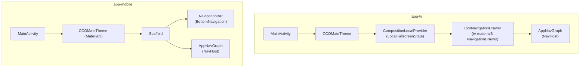
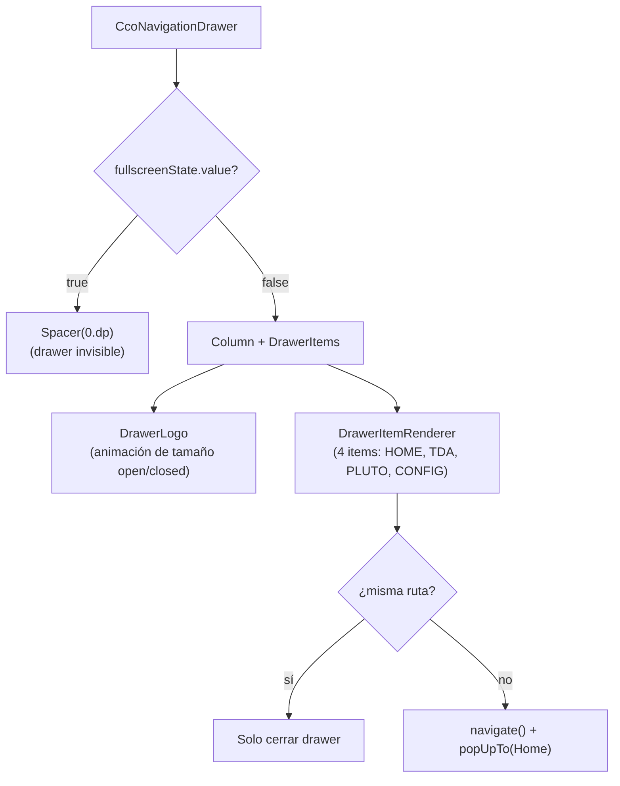
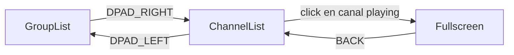
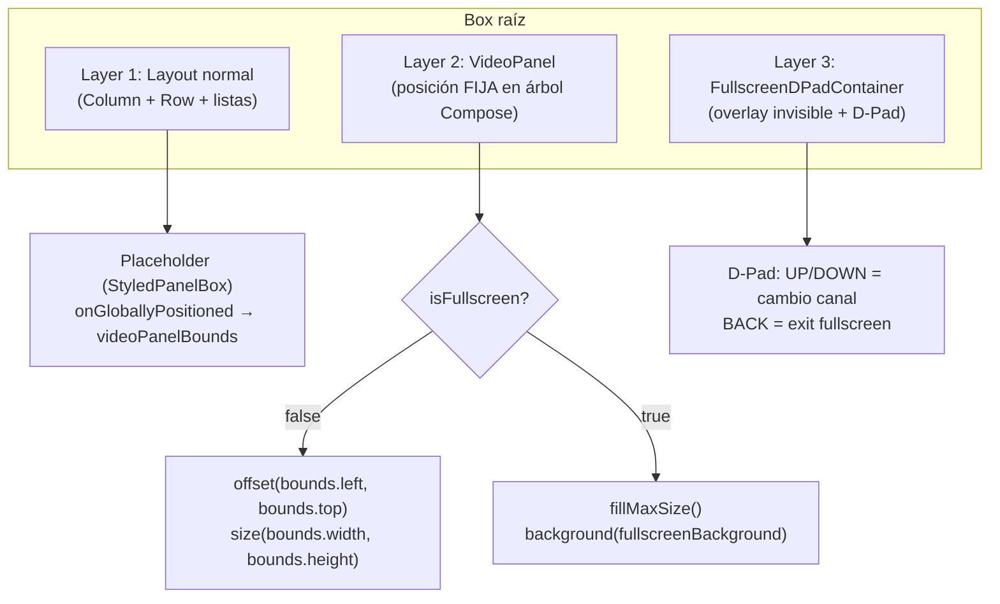
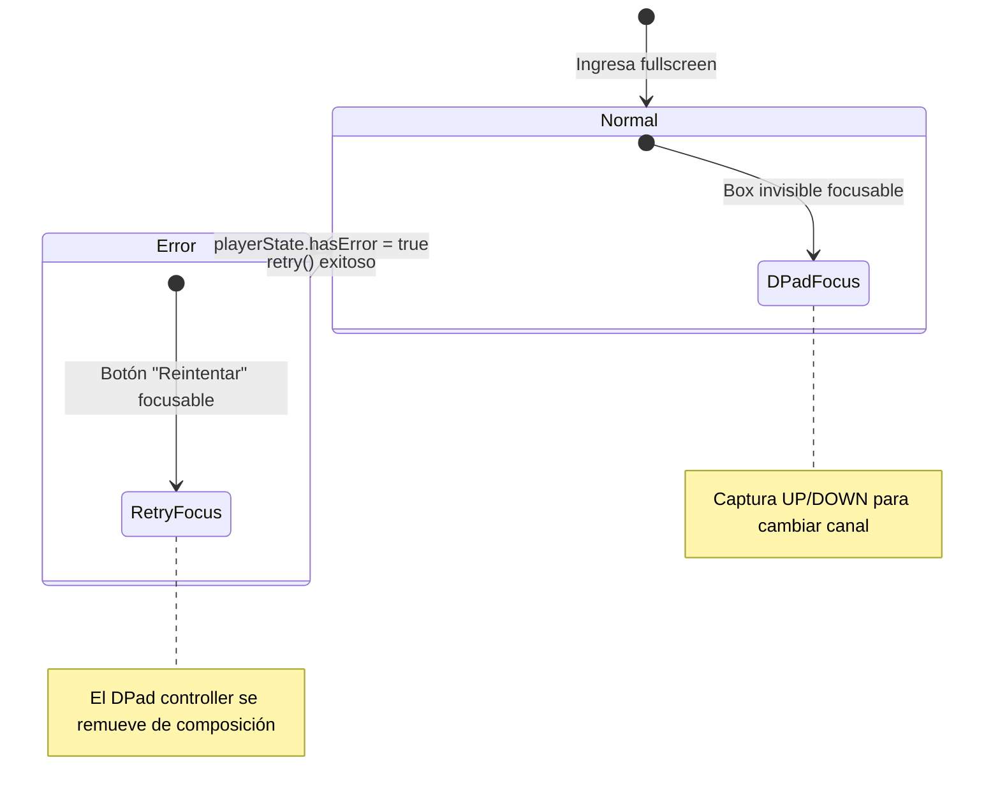
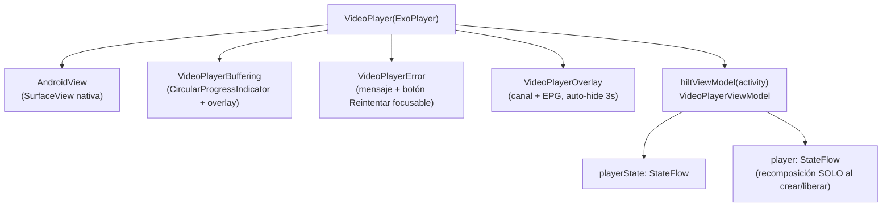
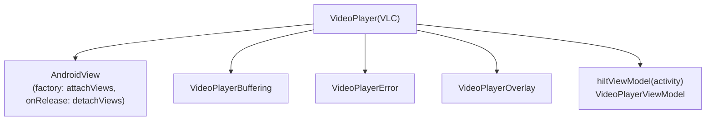
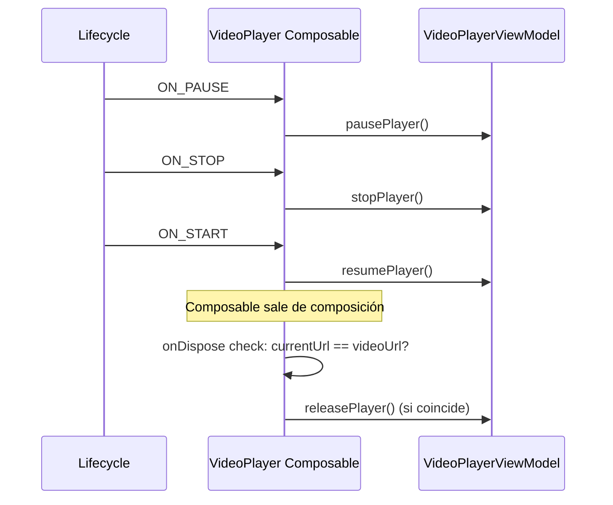
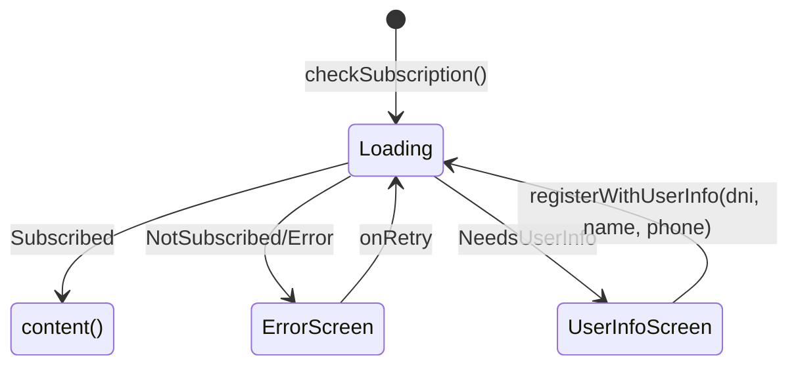

# SNAPSHOT TÉCNICO: ETAPA 4 — Interfaces de Usuario Específicas

> **Módulos:** `:app-tv` y `:app-mobile`  
> **Flavors UI:** `exoplayer` y `vlc` (VideoPlayer composable por variante)  
> **Fecha de análisis:** 2026-04-04  
> **Status:** ✅ **100% Implementado** (actualizado 2026-04-04 - P1 falso positivo corregido)

---

## 1. Arquitectura de Navegación

### 1.1 Comparación de plataformas



| Aspecto | `:app-tv` | `:app-mobile` |
|---------|-----------|---------------|
| **Navegación** | `NavigationDrawer` (lateral, D-Pad) | `NavigationBar` (inferior, touch) |
| **Rutas** | `sealed class Route(val path)` | `sealed class Route(val path, val label, val icon)` |
| **Fullscreen** | `CompositionLocalProvider(LocalFullscreenState)` | Rotación landscape = fullscreen |
| **Edge-to-Edge** | No (TV no tiene system bars) | `enableEdgeToEdge()` |
| **Tema** | `CCOMateTheme` (tv-material3) | `CCOMateTheme` (Material3 estándar) |
| **State restoration** | `popUpTo(Home) { saveState = true }` | `popUpTo(startDestination) { saveState = true }` |

### 1.2 Rutas registradas

| Ruta | TV | Mobile | Pantalla |
|------|:--:|:------:|----------|
| `"home"` | ✅ | ✅ | Banner con logo (Coil AsyncImage) |
| `"tda"` | ✅ | ✅ | Canales TDA |
| `"plutotv"` | ✅ | ✅ | Canales Pluto TV + EPG |
| `"settings"` | ✅ | ✅ | Refresh manual de datos |

---

## 2. :app-tv — Sistema de Navegación D-Pad

### 2.1 CcoNavigationDrawer



**Características clave:**
- **Oculta en fullscreen:** Cuando `fullscreenState.value = true`, el drawer se reemplaza por un `Spacer(0.dp)` invisible
- **Logo animado:** `animateDpAsState` para transición de tamaño al abrir/cerrar (satellite: 16↔25dp, logo: 35↔70dp, duración 300ms)
- **Foco al cerrar:** `LaunchedEffect(drawerState.currentValue)` devuelve el foco al content cuando el drawer se cierra
- **DrawerIcon polimórfico:** `sealed class DrawerIcon` (Vector para Material Icons, Resource para drawables locales)

### 2.2 Navegación D-Pad inter-listas



| Tecla | En GroupList | En ChannelList | En Fullscreen |
|-------|------------|----------------|---------------|
| `DPAD_UP/DOWN` | Navega entre grupos | Navega entre canales | Cambia canal (wrap-around) |
| `DPAD_RIGHT` | Pasa foco a ChannelList | — | Consumido (no-op) |
| `DPAD_LEFT` | — | Pasa foco a GroupList | Consumido (no-op) |
| `CENTER/ENTER` | Selecciona grupo | 1er click: reproduce; 2do: fullscreen | Consumido (no-op) |
| `BACK` | — | — | Sale de fullscreen |

### 2.3 Foco con escala animada

```kotlin
// Patrón repetido en GroupList y ChannelList
val scaleFactor = 1.1f

val focusScale by animateFloatAsState(
    targetValue = if (hasFocus) scaleFactor else 1f,
    animationSpec = tween(durationMillis = 200)
)

Modifier
    .fillMaxWidth(1f / scaleFactor)  // ~90.9%: al escalar 1.1x llena 100%
    .scale(focusScale)               // Escala animada
    .border(if (hasFocus) 2.dp else 0.dp, ...)
    .focusRequester(itemFocusRequester)
    .onFocusChanged { hasFocus = it.isFocused }
```

> [!TIP]
> El truco de `fillMaxWidth(1f/scaleFactor)` previene overflow: el item ocupa ~90.9% del ancho, y al escalarse 1.1x, llena exactamente el 100% sin desbordar.

---

## 3. :app-tv — Arquitectura de 3 Capas (ChannelScreen)

### 3.1 Problema resuelto

Al alternar fullscreen/normal, mover un `AndroidView` (ExoPlayer/VLC) entre padres destruye la `Surface` nativa, causando pantalla negra de ~500ms-2s.

### 3.2 Solución: Posición fija + bounds dinámicos



### 3.3 Flujo detallado

```kotlin
// Layer 1: Placeholder que captura bounds
StyledPanelBox(
    modifier = Modifier
        .onGloballyPositioned { panelCoords ->
            val root = rootCoordsRef[0] ?: return
            val relativePos = root.localPositionOf(panelCoords, Offset.Zero)
            val size = panelCoords.size
            videoPanelBounds = Rect(
                relativePos.x, relativePos.y,
                relativePos.x + size.width,
                relativePos.y + size.height
            )
        }
)

// Layer 2: Video posicionado dinámicamente
val videoModifier = if (isFullscreen || videoPanelBounds == Rect.Zero) {
    Modifier.fillMaxSize()
} else {
    with(density) {
        Modifier
            .offset(x = videoPanelBounds.left.toDp(), y = videoPanelBounds.top.toDp())
            .size(width = videoPanelBounds.width.toDp(), height = videoPanelBounds.height.toDp())
    }
}
```

> [!IMPORTANT]
> Se usa `localPositionOf` (posición relativa al Box raíz) en vez de `boundsInRoot` porque el drawer de navegación desplaza las coordenadas absolutas, causando desajustes. Se almacena `Rect` (data class con equals por valor), NO `LayoutCoordinates` (que no tiene equals y causa recomposición infinita).

### 3.4 Estados derivados cacheados

```kotlin
val selectedGroup by remember(uiState.groups, uiState.selectedGroupIndex) {
    derivedStateOf { uiState.groups.getOrNull(uiState.selectedGroupIndex) }
}
val filteredChannels by remember(uiState.allChannels, selectedGroup) {
    derivedStateOf { uiState.allChannels.filter { it.group == selectedGroup } }
}
val selectedChannel by remember(uiState.allChannels, uiState.selectedChannelUrl) {
    derivedStateOf { uiState.allChannels.firstOrNull { it.url == uiState.selectedChannelUrl } }
}
```

> Estos `derivedStateOf` evitan recalcular filtros en cada recomposición — solo se recalculan cuando cambian las keys.

---

## 4. :app-tv — FullscreenDPadContainer

### 4.1 Modo inmersivo

```kotlin
DisposableEffect(Unit) {
    val controller = WindowCompat.getInsetsController(window, decorView)
    controller.hide(WindowInsetsCompat.Type.systemBars())
    controller.systemBarsBehavior = BEHAVIOR_SHOW_TRANSIENT_BARS_BY_SWIPE
    
    onDispose {
        controller.show(WindowInsetsCompat.Type.systemBars())
        controller.systemBarsBehavior = BEHAVIOR_DEFAULT
    }
}
```

### 4.2 Cambio de canal circular con D-Pad

```kotlin
val currentIndex by remember(channels, selectedChannelUrl) {
    derivedStateOf { channels.indexOfFirst { it.url == selectedChannelUrl } }
}

when (event.nativeKeyEvent.keyCode) {
    KEYCODE_DPAD_UP -> {
        val prevIndex = if (currentIndex <= 0) channels.size - 1 else currentIndex - 1
        onChannelChanged(channels[prevIndex])
    }
    KEYCODE_DPAD_DOWN -> {
        val nextIndex = (currentIndex + 1) % channels.size
        onChannelChanged(channels[nextIndex])
    }
    // CENTER, ENTER, LEFT, RIGHT → consumidos (true), sin acción
}
```

### 4.3 Foco mutuamente excluyente



> [!NOTE]
> Cuando `hasPlayerError = true`, el `Box` focusable del D-Pad se **elimina del árbol de Compose** (no solo oculta), liberando el foco para que el botón "Reintentar" del `VideoPlayerError` sea el único nodo focusable.

---

## 5. :app-tv — VideoPlayer Composables (flavor-specific)

### 5.1 ExoPlayer — VideoPlayer.kt



**Optimización P1.3:** `PlayerSurface` observa únicamente `player: StateFlow<ExoPlayer?>`, NO `playerState`. Los cambios de `isBuffering`/`isPlaying` NO causan recomposición del `AndroidView`.

### 5.2 VLC — VideoPlayer.kt



**Diferencia clave:** VLC usa `onRelease` callback de `AndroidView` para `detachViews(layout)`, no `onDispose` de `DisposableEffect`. Esto garantiza que el detach ocurra cuando la vista nativa se destruye.

### 5.3 Scoped al Activity, no a la pantalla

```kotlin
val activity = context.findActivity()
val viewModel: VideoPlayerViewModel = hiltViewModel(viewModelStoreOwner = activity)
```

> [!WARNING]
> El `VideoPlayerViewModel` se scopa al **Activity**, no al composable ni al NavBackStackEntry. Esto permite que persista entre pantallas TDA ↔ Pluto sin recrearse. El `DisposableEffect(Unit).onDispose` solo libera el player si `currentUrl == videoUrl` para evitar que la pantalla saliente destruya el player de la entrante.

### 5.4 Ciclo de vida del player



---

## 6. :app-tv — Componentes de UI

### 6.1 Overlays del VideoPlayer

| Componente | Visibilidad | Contenido |
|-----------|------------|-----------|
| `VideoPlayerBuffering` | `isBuffering && !hasError` | `CircularProgressIndicator` sobre overlay oscuro |
| `VideoPlayerError` | `hasError` | Mensaje de error + nombre canal + botón "Reintentar" focusable |
| `VideoPlayerOverlay` | `showOverlay && !hasError` (auto-hide 3s) | Nombre del programa EPG, horario HH:mm, descripción (3 líneas max) |

### 6.2 Skeleton Loading (shimmer)

```kotlin
@Composable
fun ShimmerBox(modifier: Modifier, shape: Shape) {
    val translateAnimation by transition.animateFloat(
        initialValue = 0f, targetValue = 2000f,
        animationSpec = infiniteRepeatable(tween(1200, FastOutSlowInEasing), Restart)
    )
    val brush = Brush.linearGradient(
        colors = listOf(Color(0xFF2C2C2C), Color(0xFF424242), Color(0xFF2C2C2C)),
        start = Offset(translateAnimation - 500f, ...),
        end = Offset(translateAnimation, ...)
    )
    Box(modifier.background(brush, shape))
}
```

| Componente | Dimensiones | Uso |
|-----------|------------|-----|
| `GroupSkeletonItem` | fillMaxWidth × 40dp | Placeholder de grupo durante carga |
| `ChannelSkeletonItem` | fillMaxWidth × 65dp | Placeholder de canal con thumbnail shimmer (80×45dp) |

### 6.3 SubscriptionGate



> Wrapper composable que bloquea todo el contenido hasta que la suscripción sea válida. Se inyecta alrededor del NavGraph o de pantallas individuales.

---

## 7. :app-mobile — Diseño Adaptativo

### 7.1 Detección de orientación

```kotlin
val configuration = LocalConfiguration.current
val isLandscape = configuration.orientation == Configuration.ORIENTATION_LANDSCAPE
```

### 7.2 Layout Portrait vs Landscape

````carousel
**Portrait:**
```
┌──────────────────┐
│    VideoPlayer    │ ← 16:9 aspect ratio
│   (ExoPlayer)     │
├──────────────────┤
│ Canal: ESPN HD   │ ← Channel name + status
│ Cargando...      │
├──────────────────┤
│ [Deportes] [Cine]│ ← FilterChip (LazyRow horizontal)
│ [Noticias] ...   │
├──────────────────┤
│ ┌──┐ ESPN HD     │ ← LazyColumn con ChannelRow
│ │🖼│ Deportes    │   (logo 48dp + nombre + grupo)
│ └──┘             │
│ ┌──┐ Fox Sports  │
│ │🖼│ Deportes    │
│ └──┘             │
└──────────────────┘
   [🏠] [📺] [⭐] [⚙️]  ← BottomNavigationBar
```
<!-- slide -->
**Landscape:**
```
┌──────────────────────────────────┐
│                                  │
│         VideoPlayer              │ ← fillMaxSize() + ImmersiveMode
│        (fullscreen)              │   System bars ocultas
│                                  │
│                                  │
└──────────────────────────────────┘
  (sin BottomBar, sin listas)
```
````

### 7.3 BottomNavigationBar — Oculta en landscape

```kotlin
Scaffold(
    bottomBar = {
        if (!isLandscape) {  // Oculta en landscape
            NavigationBar(containerColor = MobileColors.surface) {
                bottomNavItems.forEach { route ->
                    NavigationBarItem(
                        selected = currentDestination?.hierarchy?.any { it.route == route.path },
                        onClick = { navController.navigate(route.path) { ... } },
                        icon = { Icon(route.icon) },
                        label = { Text(route.label) }
                    )
                }
            }
        }
    }
)
```

### 7.4 movableContentOf en Mobile

```kotlin
// MobileChannelScreen.kt
val videoContent = remember {
    movableContentOf { url: String?, name: String? ->
        if (url != null) {
            VideoPlayer(
                videoUrl = url,
                channelName = name,
                onPlaybackStarted = { viewModel.onPlaybackStarted(name) },
                onPlaybackError = { viewModel.onPlaybackError(it) },
                modifier = Modifier.fillMaxSize()
            )
        } else { ... }
    }
}

// Portrait: dentro de Column → Box(aspectRatio 16:9)
videoContent(uiState.selectedChannelUrl, uiState.selectedChannelName)

// Landscape: dentro de Box(fillMaxSize)
videoContent(uiState.selectedChannelUrl, uiState.selectedChannelName)
```

> [!IMPORTANT]
> **Mobile SÍ usa `movableContentOf`** para preservar el `VideoPlayer` al rotar portrait↔landscape. Esto contrasta con TV que usa el sistema de 3 capas con bounds dinámicos. La razón es que en mobile, rotar **destruye y recrea la Activity** (a menos que se configure `configChanges`), y `movableContentOf` permite que Compose "mueva" el composable al nuevo padre sin destruir el `AndroidView` subyacente.

### 7.5 ImmersiveMode en Mobile

```kotlin
@Composable
private fun ImmersiveMode(enabled: Boolean) {
    val activity = context as? Activity ?: return
    DisposableEffect(enabled) {
        val controller = WindowCompat.getInsetsController(window, decorView)
        if (enabled) {
            controller.hide(WindowInsetsCompat.Type.systemBars())
            controller.systemBarsBehavior = BEHAVIOR_SHOW_TRANSIENT_BARS_BY_SWIPE
        } else {
            controller.show(WindowInsetsCompat.Type.systemBars())
        }
        onDispose { controller.show(...) }
    }
}
```

### 7.6 Mobile VideoPlayer (ExoPlayer)

Versión simplificada comparada con TV:

| Característica | TV | Mobile |
|---------------|:--:|:------:|
| Overlay EPG (programa actual) | ✅ | ❌ |
| Overlay canal (auto-hide 3s) | ✅ | ❌ |
| Error con botón "Reintentar" focusable | ✅ (`VideoPlayerError`) | ❌ (solo `Text`) |
| Buffering animado con overlay | ✅ (`VideoPlayerBuffering`) | Material3 `CircularProgressIndicator` |
| `onErrorStateChanged` callback | ✅ | ❌ |
| `isFullscreen` parámetro | ✅ | ❌ |

---

## 8. Sistema de Temas

### 8.1 :app-tv — Design Tokens

| Archivo | Responsabilidad |
|---------|----------------|
| `AppTheme.kt` | `AppColors`, `AppGradients`, `AppTypography`, `AppDimensions` |
| `PlutoColors.kt` | Paleta de la pantalla Pluto (gradientes, bordes, estados) |
| `Theme.kt` | `CCOMateTheme` wrapper de tv-material3 |

**Reglas TV-safe:**
- Evitar negro puro `#000000` → usar `#121212`
- Evitar blanco puro `#FFFFFF` → usar `#F5F5F5`
- Mínimo 14sp para cualquier texto
- Overscan 5%: `horizontalPadding = 48.dp`, `verticalPadding = 27.dp`

### 8.2 :app-mobile — MobileColors

```kotlin
object MobileColors {
    val primary = Color(0xFF6750A4)
    val onPrimary = Color.White
    val background = Color(0xFF121212)
    val surface = Color(0xFF1E1E1E)
    val surfaceVariant = Color(0xFF2C2C2C)
    val textPrimary = Color(0xFFE1E1E1)
    val textSecondary = Color(0xFF9E9E9E)
    val selectedItem = Color(0xFF2D2438)
    val playerBackground = Color.Black
    val divider = Color(0xFF333333)
}
```

### 8.3 Comparación visual

| Token | TV (`AppColors`) | Mobile (`MobileColors`) |
|-------|:---:|:---:|
| Background | `#121212` | `#121212` |
| Surface | — | `#1E1E1E` |
| Text primary | `#F5F5F5` | `#E1E1E1` |
| Text secondary | `#F5F5F5` @ 70% | `#9E9E9E` |
| Primary accent | `#2196F3` (blue) | `#6750A4` (purple) |
| Focus indicator | `#FFEB3B` (yellow) + scale | N/A (touch) |

---

## 9. Inventario completo de archivos UI

### :app-tv

| Archivo | Líneas | Función |
|---------|:------:|---------|
| `MainActivity.kt` | 42 | Punto de entrada, CompositionLocalProvider |
| `CcoMateApplication.kt` | 33 | Coil ImageLoader (15% heap, 50MB disco) |
| **Navegación** | | |
| `Route.kt` | 17 | Rutas selladas |
| `NavGraph.kt` | 21 | NavHost con 4 destinos |
| `CcoNavigationDrawer.kt` | 88 | Drawer TV con fullscreen toggle |
| `DrawerItemRenderer.kt` | 49 | Items del drawer con colores |
| `DrawerItemsList.kt` | 20 | Datos de los 4 items del drawer |
| `DrawerLogo.kt` | 46 | Logo animado |
| `DrawerIconContent.kt` | 32 | Renderer polimórfico de iconos |
| **Pantallas** | | |
| `HomeScreen.kt` | 56 | Banner con animación de entrada |
| `ChannelScreen.kt` (base) | 262 | Arquitectura de 3 capas |
| `PlutoTvScreen.kt` | 44 | Wrapper Pluto |
| `TDAScreen.kt` | 42 | Wrapper TDA |
| `SettingsScreen.kt` | 202 | Refresh manual con D-Pad |
| **Componentes** | | |
| `PlutoComponents.kt` | 195 | ChannelInfoPanel, StyledPanelBox, EpgInfoBlock, TimeWarningBanner |
| `PlutoColors.kt` | 44 | Paleta Pluto |
| `SkeletonComponent.kt` | 106 | ShimmerBox, GroupSkeleton, ChannelSkeleton |
| `SubscriptionGate.kt` | 39 | Gate de suscripción |
| **Video** | | |
| `VideoPanel.kt` | 78 | Wrapper con loading + EPG panel |
| `VideoPlayer.kt` (exo) | 176 | ExoPlayer composable |
| `VideoPlayer.kt` (vlc) | 156 | VLC composable |
| `VideoPlayerBuffering.kt` | 35 | Indicador de carga |
| `VideoPlayerError.kt` | 130 | Error con retry focusable |
| `VideoPlayerOverlay.kt` | 86 | Info canal/EPG con auto-hide |
| `FullscreenDPadContainer.kt` | 138 | Inmersión + D-Pad canal |
| **Listas** | | |
| `GroupList.kt` | 134 | Grupos con foco escalado |
| `ChannelList.kt` | 266 | Canales con logo, foco, scroll, restore |

### :app-mobile

| Archivo | Líneas | Función |
|---------|:------:|---------|
| `MainActivity.kt` | 97 | Scaffold + BottomNav + orientación |
| `CcoMateApplication.kt` | 33 | Coil ImageLoader (copia de TV) |
| **Navegación** | | |
| `Route.kt` | 18 | Rutas con icon + label |
| `AppNavGraph.kt` | 27 | NavHost con 4 destinos |
| **Pantallas** | | |
| `HomeScreen.kt` | 41 | Banner simple |
| `MobileChannelScreen.kt` | 266 | Layout adaptativo + movableContentOf |
| `PlutoTvScreen.kt` | 14 | Wrapper mínimo |
| `TDAScreen.kt` | 14 | Wrapper mínimo |
| `MobileSettingsScreen.kt` | 169 | Refresh con scroll + touch |
| **Video** | | |
| `VideoPlayer.kt` (exo) | 138 | ExoPlayer simplificado (sin overlays) |
| `VideoPlayer.kt` (vlc) | 168 | ✅ VLC completamente implementado |

---

## 10. Observaciones Críticas

1. **ChannelScreen de 3 capas (TV) — solución elegante:** Al NO re-parentear el `AndroidView`, la Surface nativa NUNCA se destruye durante transiciones fullscreen. Esto elimina completamente la pantalla negra. Es más robusto que `movableContentOf` para TV porque no depende del heurístico de Compose para "mover" nodos.

2. **movableContentOf solo en Mobile:** Se usa correctamente para mover el `VideoPlayer` entre layouts portrait/landscape sin destruir la Surface. En TV no se usa porque el video tiene posición fija.

3. **✅ VideoPlayer VLC en Mobile:** El source set `app-mobile/src/vlc/java/.../VideoPlayer.kt` **está completamente implementado**. Compila exitosamente y funciona en todos los sabores VLC de mobile (verificado por usuario en Android Studio).

4. **VideoPlayer Mobile vs TV — diferencias intencionadas:** Mobile carece de overlay de canal, EPG en la pantalla de video, botón "Reintentar" focusable, y skeleton loading. Esto es una decisión de diseño intencional para simplificar la UI mobile vs TV (que es más compleja con D-Pad y overlays).

5. **CcoMateApplication duplicada:** El código de Coil `ImageLoaderFactory` es **idéntico** en ambos módulos. Debería extraerse al `:core`.

6. **Colores inconsistentes entre plataformas:** TV usa `#2196F3` (blue) como accent y `#FFEB3B` (yellow) como foco. Mobile usa `#6750A4` (Material purple). No hay un sistema de design tokens unificado entre plataformas.

7. **SettingsScreen TV con D-Pad:** Los botones usan `onKeyEvent` → `Key.DirectionCenter/Enter` para activación, con estados de foco visual (`isFocused`). Mobile usa `clickable` estándar. Ambos comparten el mismo `SettingsViewModel`.

8. **Foco inicial en ChannelList:** Usa `snapshotFlow` + `filter { it }.first()` para esperar a que Compose materialice el item después del scroll antes de pedir foco — patrón robusto para evitar `FocusRequester is not attached`.

9. **EPG panel deshabilitado:** La constante `ENABLE_EPG_PANEL = false` en `VideoPanel.kt` oculta la información EPG directamente sobre el video. Solo se muestra en el panel lateral (`ChannelInfoPanel`).

---

> **Etapa 4 completada.** La documentación técnica de las 4 etapas está completa. Los artefactos generados son:
> - `etapa1_infraestructura.md` — Grafo de dependencias y stack
> - `etapa2_datos_y_dominio.md` — Room, repositorios, parsers, red
> - `etapa3_logica_negocio.md` — ViewModels, estado, reproducción
> - `etapa4_interfaces_ui.md` — UI completa TV y Mobile

---

## ✅ Actualización 2026-04-04

**Corrección:** Se removió la observación crítica "VideoPlayer VLC faltante en Mobile" que fue un falso positivo.

- **Lo que se reportó:** El archivo no existía en app-mobile/src/vlc/
- **La realidad:** El archivo `app-mobile/src/vlc/.../VideoPlayer.kt` SÍ EXISTE y está completamente implementado (168 líneas)
- **Compilación:** ✅ Ambos flavors compilan exitosamente en mobile
- **Verificación:** Usuario confirmó compilación, instalación y ejecución exitosa en Android Studio

**Consecuencia:** 
- ✅ Etapa 4 ahora es 100% completa (era 97%)
- ✅ No hay disparidad de features entre flavors mobile - ambos tienen implementación completa
